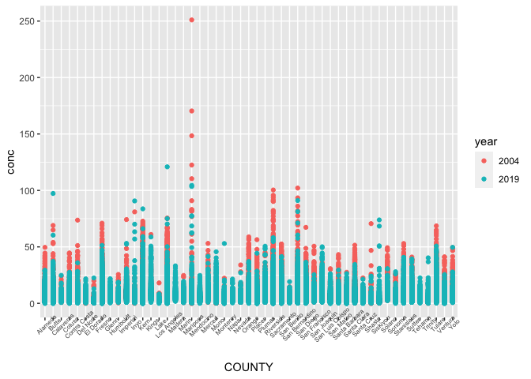
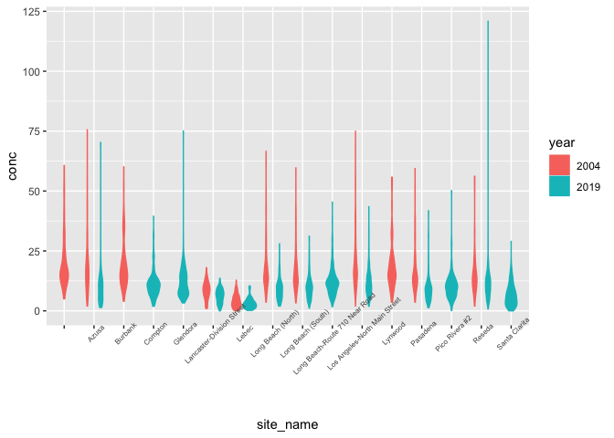

PM566\_HW1
================
Caroline He
9/21/2021

## Assignment Description

We will work with air pollution data from the U.S. Environmental
Protection Agency (EPA). The EPA has a national monitoring network of
air pollution sites. The primary question is whether daily
concentrations of PM2.5 (particulate matter air pollution with
aerodynamic diameter less than 2.5 m) have decreased in California over
the last 15 years (from 2004 to 2019).

## R packages setup

``` r
library(data.table)
library(tidyverse)
```

    ## ── Attaching packages ─────────────────────────────────────── tidyverse 1.3.1 ──

    ## ✓ ggplot2 3.3.5     ✓ purrr   0.3.4
    ## ✓ tibble  3.1.4     ✓ dplyr   1.0.7
    ## ✓ tidyr   1.1.3     ✓ stringr 1.4.0
    ## ✓ readr   2.0.1     ✓ forcats 0.5.1

    ## ── Conflicts ────────────────────────────────────────── tidyverse_conflicts() ──
    ## x dplyr::between()   masks data.table::between()
    ## x dplyr::filter()    masks stats::filter()
    ## x dplyr::first()     masks data.table::first()
    ## x dplyr::lag()       masks stats::lag()
    ## x dplyr::last()      masks data.table::last()
    ## x purrr::transpose() masks data.table::transpose()

# Step 1: Given the formulated question, conduct EDA Checklist items 2-4.

1.  Download 2004 and 2019 data for all sites in California from the EPA
    Air Quality Data website.
2.  Read in the data using data.table(). For each of the two datasets,
    check the dimensions, headers, footers, variable names and variable
    types.

``` r
# Read in data set
PM2.5_2004 <- data.table::fread("2004_CA_PM2.5.csv")
PM2.5_2019 <- data.table::fread("2019_CA_PM2.5.csv")

# Check data dimensions
dim(PM2.5_2004)
```

    ## [1] 19233    20

``` r
dim(PM2.5_2019)
```

    ## [1] 53086    20

``` r
# Check data headers
head(PM2.5_2004)
```

    ##          Date Source  Site ID POC Daily Mean PM2.5 Concentration    UNITS
    ## 1: 01/01/2004    AQS 60010007   1                           11.0 ug/m3 LC
    ## 2: 01/02/2004    AQS 60010007   1                           12.2 ug/m3 LC
    ## 3: 01/03/2004    AQS 60010007   1                           16.5 ug/m3 LC
    ## 4: 01/04/2004    AQS 60010007   1                           19.5 ug/m3 LC
    ## 5: 01/05/2004    AQS 60010007   1                           11.5 ug/m3 LC
    ## 6: 01/06/2004    AQS 60010007   1                           32.5 ug/m3 LC
    ##    DAILY_AQI_VALUE Site Name DAILY_OBS_COUNT PERCENT_COMPLETE
    ## 1:              46 Livermore               1              100
    ## 2:              51 Livermore               1              100
    ## 3:              60 Livermore               1              100
    ## 4:              67 Livermore               1              100
    ## 5:              48 Livermore               1              100
    ## 6:              94 Livermore               1              100
    ##    AQS_PARAMETER_CODE                     AQS_PARAMETER_DESC CBSA_CODE
    ## 1:              88502 Acceptable PM2.5 AQI & Speciation Mass     41860
    ## 2:              88502 Acceptable PM2.5 AQI & Speciation Mass     41860
    ## 3:              88502 Acceptable PM2.5 AQI & Speciation Mass     41860
    ## 4:              88502 Acceptable PM2.5 AQI & Speciation Mass     41860
    ## 5:              88502 Acceptable PM2.5 AQI & Speciation Mass     41860
    ## 6:              88502 Acceptable PM2.5 AQI & Speciation Mass     41860
    ##                            CBSA_NAME STATE_CODE      STATE COUNTY_CODE  COUNTY
    ## 1: San Francisco-Oakland-Hayward, CA          6 California           1 Alameda
    ## 2: San Francisco-Oakland-Hayward, CA          6 California           1 Alameda
    ## 3: San Francisco-Oakland-Hayward, CA          6 California           1 Alameda
    ## 4: San Francisco-Oakland-Hayward, CA          6 California           1 Alameda
    ## 5: San Francisco-Oakland-Hayward, CA          6 California           1 Alameda
    ## 6: San Francisco-Oakland-Hayward, CA          6 California           1 Alameda
    ##    SITE_LATITUDE SITE_LONGITUDE
    ## 1:      37.68753      -121.7842
    ## 2:      37.68753      -121.7842
    ## 3:      37.68753      -121.7842
    ## 4:      37.68753      -121.7842
    ## 5:      37.68753      -121.7842
    ## 6:      37.68753      -121.7842

``` r
head(PM2.5_2019)
```

    ##          Date Source  Site ID POC Daily Mean PM2.5 Concentration    UNITS
    ## 1: 01/01/2019    AQS 60010007   3                            5.7 ug/m3 LC
    ## 2: 01/02/2019    AQS 60010007   3                           11.9 ug/m3 LC
    ## 3: 01/03/2019    AQS 60010007   3                           20.1 ug/m3 LC
    ## 4: 01/04/2019    AQS 60010007   3                           28.8 ug/m3 LC
    ## 5: 01/05/2019    AQS 60010007   3                           11.2 ug/m3 LC
    ## 6: 01/06/2019    AQS 60010007   3                            2.7 ug/m3 LC
    ##    DAILY_AQI_VALUE Site Name DAILY_OBS_COUNT PERCENT_COMPLETE
    ## 1:              24 Livermore               1              100
    ## 2:              50 Livermore               1              100
    ## 3:              68 Livermore               1              100
    ## 4:              86 Livermore               1              100
    ## 5:              47 Livermore               1              100
    ## 6:              11 Livermore               1              100
    ##    AQS_PARAMETER_CODE       AQS_PARAMETER_DESC CBSA_CODE
    ## 1:              88101 PM2.5 - Local Conditions     41860
    ## 2:              88101 PM2.5 - Local Conditions     41860
    ## 3:              88101 PM2.5 - Local Conditions     41860
    ## 4:              88101 PM2.5 - Local Conditions     41860
    ## 5:              88101 PM2.5 - Local Conditions     41860
    ## 6:              88101 PM2.5 - Local Conditions     41860
    ##                            CBSA_NAME STATE_CODE      STATE COUNTY_CODE  COUNTY
    ## 1: San Francisco-Oakland-Hayward, CA          6 California           1 Alameda
    ## 2: San Francisco-Oakland-Hayward, CA          6 California           1 Alameda
    ## 3: San Francisco-Oakland-Hayward, CA          6 California           1 Alameda
    ## 4: San Francisco-Oakland-Hayward, CA          6 California           1 Alameda
    ## 5: San Francisco-Oakland-Hayward, CA          6 California           1 Alameda
    ## 6: San Francisco-Oakland-Hayward, CA          6 California           1 Alameda
    ##    SITE_LATITUDE SITE_LONGITUDE
    ## 1:      37.68753      -121.7842
    ## 2:      37.68753      -121.7842
    ## 3:      37.68753      -121.7842
    ## 4:      37.68753      -121.7842
    ## 5:      37.68753      -121.7842
    ## 6:      37.68753      -121.7842

``` r
# Check data footers
tail(PM2.5_2004)
```

    ##          Date Source  Site ID POC Daily Mean PM2.5 Concentration    UNITS
    ## 1: 12/14/2004    AQS 61131003   1                             11 ug/m3 LC
    ## 2: 12/17/2004    AQS 61131003   1                             16 ug/m3 LC
    ## 3: 12/20/2004    AQS 61131003   1                             17 ug/m3 LC
    ## 4: 12/23/2004    AQS 61131003   1                              9 ug/m3 LC
    ## 5: 12/26/2004    AQS 61131003   1                             24 ug/m3 LC
    ## 6: 12/29/2004    AQS 61131003   1                              9 ug/m3 LC
    ##    DAILY_AQI_VALUE            Site Name DAILY_OBS_COUNT PERCENT_COMPLETE
    ## 1:              46 Woodland-Gibson Road               1              100
    ## 2:              59 Woodland-Gibson Road               1              100
    ## 3:              61 Woodland-Gibson Road               1              100
    ## 4:              38 Woodland-Gibson Road               1              100
    ## 5:              76 Woodland-Gibson Road               1              100
    ## 6:              38 Woodland-Gibson Road               1              100
    ##    AQS_PARAMETER_CODE       AQS_PARAMETER_DESC CBSA_CODE
    ## 1:              88101 PM2.5 - Local Conditions     40900
    ## 2:              88101 PM2.5 - Local Conditions     40900
    ## 3:              88101 PM2.5 - Local Conditions     40900
    ## 4:              88101 PM2.5 - Local Conditions     40900
    ## 5:              88101 PM2.5 - Local Conditions     40900
    ## 6:              88101 PM2.5 - Local Conditions     40900
    ##                                  CBSA_NAME STATE_CODE      STATE COUNTY_CODE
    ## 1: Sacramento--Roseville--Arden-Arcade, CA          6 California         113
    ## 2: Sacramento--Roseville--Arden-Arcade, CA          6 California         113
    ## 3: Sacramento--Roseville--Arden-Arcade, CA          6 California         113
    ## 4: Sacramento--Roseville--Arden-Arcade, CA          6 California         113
    ## 5: Sacramento--Roseville--Arden-Arcade, CA          6 California         113
    ## 6: Sacramento--Roseville--Arden-Arcade, CA          6 California         113
    ##    COUNTY SITE_LATITUDE SITE_LONGITUDE
    ## 1:   Yolo      38.66121      -121.7327
    ## 2:   Yolo      38.66121      -121.7327
    ## 3:   Yolo      38.66121      -121.7327
    ## 4:   Yolo      38.66121      -121.7327
    ## 5:   Yolo      38.66121      -121.7327
    ## 6:   Yolo      38.66121      -121.7327

``` r
tail(PM2.5_2019)
```

    ##          Date Source  Site ID POC Daily Mean PM2.5 Concentration    UNITS
    ## 1: 11/11/2019    AQS 61131003   1                           13.5 ug/m3 LC
    ## 2: 11/17/2019    AQS 61131003   1                           18.1 ug/m3 LC
    ## 3: 11/29/2019    AQS 61131003   1                           12.5 ug/m3 LC
    ## 4: 12/17/2019    AQS 61131003   1                           23.8 ug/m3 LC
    ## 5: 12/23/2019    AQS 61131003   1                            1.0 ug/m3 LC
    ## 6: 12/29/2019    AQS 61131003   1                            9.1 ug/m3 LC
    ##    DAILY_AQI_VALUE            Site Name DAILY_OBS_COUNT PERCENT_COMPLETE
    ## 1:              54 Woodland-Gibson Road               1              100
    ## 2:              64 Woodland-Gibson Road               1              100
    ## 3:              52 Woodland-Gibson Road               1              100
    ## 4:              76 Woodland-Gibson Road               1              100
    ## 5:               4 Woodland-Gibson Road               1              100
    ## 6:              38 Woodland-Gibson Road               1              100
    ##    AQS_PARAMETER_CODE       AQS_PARAMETER_DESC CBSA_CODE
    ## 1:              88101 PM2.5 - Local Conditions     40900
    ## 2:              88101 PM2.5 - Local Conditions     40900
    ## 3:              88101 PM2.5 - Local Conditions     40900
    ## 4:              88101 PM2.5 - Local Conditions     40900
    ## 5:              88101 PM2.5 - Local Conditions     40900
    ## 6:              88101 PM2.5 - Local Conditions     40900
    ##                                  CBSA_NAME STATE_CODE      STATE COUNTY_CODE
    ## 1: Sacramento--Roseville--Arden-Arcade, CA          6 California         113
    ## 2: Sacramento--Roseville--Arden-Arcade, CA          6 California         113
    ## 3: Sacramento--Roseville--Arden-Arcade, CA          6 California         113
    ## 4: Sacramento--Roseville--Arden-Arcade, CA          6 California         113
    ## 5: Sacramento--Roseville--Arden-Arcade, CA          6 California         113
    ## 6: Sacramento--Roseville--Arden-Arcade, CA          6 California         113
    ##    COUNTY SITE_LATITUDE SITE_LONGITUDE
    ## 1:   Yolo      38.66121      -121.7327
    ## 2:   Yolo      38.66121      -121.7327
    ## 3:   Yolo      38.66121      -121.7327
    ## 4:   Yolo      38.66121      -121.7327
    ## 5:   Yolo      38.66121      -121.7327
    ## 6:   Yolo      38.66121      -121.7327

``` r
# Check variables' names and types
str(PM2.5_2004)
```

    ## Classes 'data.table' and 'data.frame':   19233 obs. of  20 variables:
    ##  $ Date                          : chr  "01/01/2004" "01/02/2004" "01/03/2004" "01/04/2004" ...
    ##  $ Source                        : chr  "AQS" "AQS" "AQS" "AQS" ...
    ##  $ Site ID                       : int  60010007 60010007 60010007 60010007 60010007 60010007 60010007 60010007 60010007 60010007 ...
    ##  $ POC                           : int  1 1 1 1 1 1 1 1 1 1 ...
    ##  $ Daily Mean PM2.5 Concentration: num  11 12.2 16.5 19.5 11.5 32.5 15.5 29.9 21 15.7 ...
    ##  $ UNITS                         : chr  "ug/m3 LC" "ug/m3 LC" "ug/m3 LC" "ug/m3 LC" ...
    ##  $ DAILY_AQI_VALUE               : int  46 51 60 67 48 94 58 88 70 59 ...
    ##  $ Site Name                     : chr  "Livermore" "Livermore" "Livermore" "Livermore" ...
    ##  $ DAILY_OBS_COUNT               : int  1 1 1 1 1 1 1 1 1 1 ...
    ##  $ PERCENT_COMPLETE              : num  100 100 100 100 100 100 100 100 100 100 ...
    ##  $ AQS_PARAMETER_CODE            : int  88502 88502 88502 88502 88502 88502 88502 88502 88502 88101 ...
    ##  $ AQS_PARAMETER_DESC            : chr  "Acceptable PM2.5 AQI & Speciation Mass" "Acceptable PM2.5 AQI & Speciation Mass" "Acceptable PM2.5 AQI & Speciation Mass" "Acceptable PM2.5 AQI & Speciation Mass" ...
    ##  $ CBSA_CODE                     : int  41860 41860 41860 41860 41860 41860 41860 41860 41860 41860 ...
    ##  $ CBSA_NAME                     : chr  "San Francisco-Oakland-Hayward, CA" "San Francisco-Oakland-Hayward, CA" "San Francisco-Oakland-Hayward, CA" "San Francisco-Oakland-Hayward, CA" ...
    ##  $ STATE_CODE                    : int  6 6 6 6 6 6 6 6 6 6 ...
    ##  $ STATE                         : chr  "California" "California" "California" "California" ...
    ##  $ COUNTY_CODE                   : int  1 1 1 1 1 1 1 1 1 1 ...
    ##  $ COUNTY                        : chr  "Alameda" "Alameda" "Alameda" "Alameda" ...
    ##  $ SITE_LATITUDE                 : num  37.7 37.7 37.7 37.7 37.7 ...
    ##  $ SITE_LONGITUDE                : num  -122 -122 -122 -122 -122 ...
    ##  - attr(*, ".internal.selfref")=<externalptr>

``` r
str(PM2.5_2019)
```

    ## Classes 'data.table' and 'data.frame':   53086 obs. of  20 variables:
    ##  $ Date                          : chr  "01/01/2019" "01/02/2019" "01/03/2019" "01/04/2019" ...
    ##  $ Source                        : chr  "AQS" "AQS" "AQS" "AQS" ...
    ##  $ Site ID                       : int  60010007 60010007 60010007 60010007 60010007 60010007 60010007 60010007 60010007 60010007 ...
    ##  $ POC                           : int  3 3 3 3 3 3 3 3 3 3 ...
    ##  $ Daily Mean PM2.5 Concentration: num  5.7 11.9 20.1 28.8 11.2 2.7 2.8 7 3.1 7.1 ...
    ##  $ UNITS                         : chr  "ug/m3 LC" "ug/m3 LC" "ug/m3 LC" "ug/m3 LC" ...
    ##  $ DAILY_AQI_VALUE               : int  24 50 68 86 47 11 12 29 13 30 ...
    ##  $ Site Name                     : chr  "Livermore" "Livermore" "Livermore" "Livermore" ...
    ##  $ DAILY_OBS_COUNT               : int  1 1 1 1 1 1 1 1 1 1 ...
    ##  $ PERCENT_COMPLETE              : num  100 100 100 100 100 100 100 100 100 100 ...
    ##  $ AQS_PARAMETER_CODE            : int  88101 88101 88101 88101 88101 88101 88101 88101 88101 88101 ...
    ##  $ AQS_PARAMETER_DESC            : chr  "PM2.5 - Local Conditions" "PM2.5 - Local Conditions" "PM2.5 - Local Conditions" "PM2.5 - Local Conditions" ...
    ##  $ CBSA_CODE                     : int  41860 41860 41860 41860 41860 41860 41860 41860 41860 41860 ...
    ##  $ CBSA_NAME                     : chr  "San Francisco-Oakland-Hayward, CA" "San Francisco-Oakland-Hayward, CA" "San Francisco-Oakland-Hayward, CA" "San Francisco-Oakland-Hayward, CA" ...
    ##  $ STATE_CODE                    : int  6 6 6 6 6 6 6 6 6 6 ...
    ##  $ STATE                         : chr  "California" "California" "California" "California" ...
    ##  $ COUNTY_CODE                   : int  1 1 1 1 1 1 1 1 1 1 ...
    ##  $ COUNTY                        : chr  "Alameda" "Alameda" "Alameda" "Alameda" ...
    ##  $ SITE_LATITUDE                 : num  37.7 37.7 37.7 37.7 37.7 ...
    ##  $ SITE_LONGITUDE                : num  -122 -122 -122 -122 -122 ...
    ##  - attr(*, ".internal.selfref")=<externalptr>

3.  Check for any data issues, particularly in the key variables.

``` r
# Check the key variables & remove "NA" data
table(PM2.5_2004$`Daily Mean PM2.5 Concentration`)
```

    ## 
    ##  -0.1     0   0.1   0.2   0.3   0.4   0.5   0.6   0.7   0.8   0.9     1   1.1 
    ##     1    11    15    20    27    32    35    41    43    40    31    94    40 
    ##   1.2   1.3   1.4   1.5   1.6   1.7   1.8   1.9     2   2.1   2.2   2.3   2.4 
    ##    40    37    31    30    43    35    37    35   112    58    43    40    47 
    ##   2.5   2.6   2.7   2.8   2.9     3   3.1   3.2   3.3   3.4   3.5   3.6   3.7 
    ##    53    59    48    58    65   198    62    64    87    55    76    79    75 
    ##   3.8   3.9     4   4.1   4.2   4.3   4.4   4.5   4.6   4.7   4.8   4.9     5 
    ##    68    59   365    74    73    74    80    94    59    78    88    80   429 
    ##   5.1   5.2   5.3   5.4   5.5   5.6   5.7   5.8   5.9     6   6.1   6.2   6.3 
    ##    82    94    97    81   100    74    95    86   103   427    84    94    97 
    ##   6.4   6.5   6.6   6.7   6.8   6.9     7   7.1   7.2   7.3   7.4   7.5   7.6 
    ##    89   103    70    95    80    86   410    89   100    83    88   101    65 
    ##   7.7   7.8   7.9     8   8.1   8.2   8.3   8.4   8.5   8.6   8.7   8.8   8.9 
    ##   123   100    84   399    73   114    88    96   108    89    96    97    92 
    ##     9   9.1   9.2   9.3   9.4   9.5   9.6   9.7   9.8   9.9    10  10.1  10.2 
    ##   360    83   105    82    86    99    67   107    89    73   275    99    99 
    ##  10.3  10.4  10.5  10.6  10.7  10.8  10.9    11  11.1  11.2  11.3  11.4  11.5 
    ##    85    70   108    76    95    88    91   267    70    91    97    70    86 
    ##  11.6  11.7  11.8  11.9    12  12.1  12.2  12.3  12.4  12.5  12.6  12.7  12.8 
    ##    73    75    74    61   228    76    72    70    81    75    82    67    71 
    ##  12.9    13  13.1  13.2  13.3  13.4  13.5  13.6  13.7  13.8  13.9    14  14.1 
    ##    54   166    63    73    62    55    69    64    58    59    49   137    64 
    ##  14.2  14.3  14.4  14.5  14.6  14.7  14.8  14.9    15  15.1  15.2  15.3  15.4 
    ##    65    54    51    47    54    68    49    58   136    52    60    57    49 
    ##  15.5  15.6  15.7  15.8  15.9    16  16.1  16.2  16.3  16.4  16.5  16.6  16.7 
    ##    54    46    49    44    53   124    36    50    49    48    48    41    40 
    ##  16.8  16.9    17  17.1  17.2  17.3  17.4  17.5  17.6  17.7  17.8  17.9    18 
    ##    47    32    96    37    36    31    47    41    34    37    40    25    87 
    ##  18.1  18.2  18.3  18.4  18.5  18.6  18.7  18.8  18.9    19  19.1  19.2  19.3 
    ##    35    38    24    16    34    40    33    24    28    68    30    18    30 
    ##  19.4  19.5  19.6  19.7  19.8  19.9    20  20.1  20.2  20.3  20.4  20.5  20.6 
    ##    20    43    41    25    18    29    86    25    30    29    20    25    25 
    ##  20.7  20.8  20.9    21  21.1  21.2  21.3  21.4  21.5  21.6  21.7  21.8  21.9 
    ##    23    21    19    66    23    15    17    14    23    19    19    15    11 
    ##    22  22.1  22.2  22.3  22.4  22.5  22.6  22.7  22.8  22.9    23  23.1  23.2 
    ##    40    27    16    17    15    23    16    20    18    14    55    22    12 
    ##  23.3  23.4  23.5  23.6  23.7  23.8  23.9    24  24.1  24.2  24.3  24.4  24.5 
    ##    22    19    15    18    16    20    12    47    19    18    13     6    17 
    ##  24.6  24.7  24.8  24.9    25  25.1  25.2  25.3  25.4  25.5  25.6  25.7  25.8 
    ##    13    13    12    13    53    16    14    14    12    15    13    18     9 
    ##  25.9    26  26.1  26.2  26.3  26.4  26.5  26.6  26.7  26.8  26.9    27  27.1 
    ##    12    51    16     8    13    13    14    16     9    10    11    43    14 
    ##  27.2  27.3  27.4  27.5  27.6  27.7  27.8  27.9    28  28.1  28.2  28.3  28.4 
    ##    23     9     3    14     7     6    12    10    38    23    19    15    10 
    ##  28.5  28.6  28.7  28.8  28.9    29  29.1  29.2  29.3  29.4  29.5  29.6  29.7 
    ##     9    10     8     7    18    30    13    10    12     6    16    21    12 
    ##  29.8  29.9    30  30.1  30.2  30.3  30.4  30.5  30.6  30.7  30.8  30.9    31 
    ##    10    10    39    14    16    11     9    12    11    11    10     5    28 
    ##  31.1  31.2  31.3  31.4  31.5  31.6  31.7  31.8  31.9    32  32.1  32.2  32.3 
    ##     6    15     4    10     7     1     8    17    10    28     7    12    12 
    ##  32.4  32.5  32.6  32.7  32.8  32.9    33  33.1  33.2  33.3  33.4  33.5  33.6 
    ##     8    10     9     8    11    10    31     4     4    10    13    11     6 
    ##  33.7  33.8  33.9    34  34.1  34.2  34.3  34.4  34.5  34.6  34.7  34.8  34.9 
    ##    12     6     4    33     3     7     3    11     7     6     4     5     9 
    ##    35  35.1  35.2  35.3  35.4  35.5  35.6  35.7  35.8  35.9    36  36.1  36.2 
    ##    23     6    15     6     5     8     6     5     4     2    24     7     9 
    ##  36.3  36.4  36.5  36.6  36.7  36.8  36.9    37  37.1  37.2  37.3  37.4  37.5 
    ##     3     5     9     6     7     7     5    19     5     6     8    10     4 
    ##  37.6  37.7  37.8  37.9    38  38.1  38.2  38.3  38.4  38.5  38.6  38.7  38.8 
    ##     5     4     7     3    24     3     8     4     7     8     3     6     5 
    ##  38.9    39  39.1  39.2  39.3  39.4  39.5  39.6  39.7  39.8  39.9    40  40.1 
    ##     3    17     7     6     3     6     4     6     5     3     4     7     8 
    ##  40.2  40.3  40.4  40.5  40.6  40.7  40.8  40.9    41  41.1  41.2  41.3  41.4 
    ##     6     4     8    11     1     3     8     3    12     5     7     5     2 
    ##  41.5  41.6  41.7  41.8  41.9    42  42.1  42.2  42.3  42.4  42.5  42.6  42.7 
    ##     9     3     5     4     5     9     5     6     6     5     4     5     6 
    ##  42.9    43  43.1  43.2  43.3  43.4  43.5  43.6  43.7  43.8  43.9    44  44.1 
    ##     8    11     5     6     6     6     3     2     5     1     2    12     5 
    ##  44.2  44.3  44.4  44.5  44.6  44.7  44.8  44.9    45  45.1  45.2  45.3  45.4 
    ##     3     4     2     2     6     4     3     5     6     1     1     1     4 
    ##  45.5  45.7  45.8  45.9    46  46.1  46.2  46.3  46.4  46.5  46.6  46.7  46.8 
    ##     4     7     5     3     3     3     2     1     3     7     1     4     1 
    ##  46.9    47  47.1  47.2  47.3  47.5  47.6  47.7  47.8  47.9    48  48.1  48.2 
    ##     5     8     2     5     2     2     3     3     4     2     3     1     2 
    ##  48.3  48.4  48.5  48.6  48.7  48.9    49  49.2  49.3  49.4  49.5  49.6  49.7 
    ##     2     1     3     1     4     2     4     1     3     5     1     2     5 
    ##  49.9    50  50.1  50.2  50.4  50.5  50.6  50.8  50.9    51  51.2  51.4  51.5 
    ##     1     4     4     1     2     1     3     1     2     5     4     1     3 
    ##  51.7  51.8  51.9    52  52.1  52.2  52.4  52.5  52.7  52.8  52.9    53  53.1 
    ##     2     1     1     4     2     1     2     3     1     1     3     5     1 
    ##  53.2  53.3  53.5  53.7  53.8  53.9    54  54.2  54.3  54.4  54.6  54.8  54.9 
    ##     2     1     1     1     3     1     2     2     2     1     2     2     1 
    ##    55  55.1  55.2  55.3  55.5  55.6  55.7  55.8    56  56.1  56.2  56.3  56.4 
    ##     3     1     1     1     2     1     1     3     1     1     2     1     3 
    ##  56.8    57  57.2  57.3  57.4  57.9  58.1  58.4  58.7  58.9  59.1  59.2  59.3 
    ##     1     4     1     3     1     1     1     2     1     2     1     2     1 
    ##  59.4  59.5  59.7  59.9    60  60.1  60.3  60.4  60.5  60.7  60.8  60.9    61 
    ##     1     2     2     2     2     1     1     1     1     1     2     1     3 
    ##  61.2  61.5  61.7  61.8  62.5  62.6  62.7  63.1  63.4  63.9    64  64.9    65 
    ##     1     1     1     2     2     1     1     1     1     1     1     1     2 
    ##  65.3  65.4  66.1  66.3  66.6  67.1  67.3  67.4  68.2  68.6  68.7  68.9    69 
    ##     1     2     3     2     2     1     1     3     1     1     1     1     2 
    ##  69.3    70  70.6    71  71.4  72.4  72.8  73.6  73.7  74.2  74.5    75  75.6 
    ##     1     1     2     1     2     1     2     2     1     1     1     1     1 
    ##  76.8  77.1  77.5  79.8  80.9    81  81.4  81.6  81.9  82.3    83  86.1  90.2 
    ##     1     1     1     1     1     1     1     2     1     1     2     1     1 
    ##  90.7  90.9  91.7  93.4  93.8  95.7 100.4 102.1 110.4 122.5 148.4 170.4   251 
    ##     1     1     1     1     1     1     1     1     1     1     1     1     1

``` r
summary(PM2.5_2004$`Daily Mean PM2.5 Concentration`)
```

    ##    Min. 1st Qu.  Median    Mean 3rd Qu.    Max. 
    ##   -0.10    6.00   10.10   13.13   16.30  251.00

``` r
mean(is.na(PM2.5_2004$`Daily Mean PM2.5 Concentration`))
```

    ## [1] 0

``` r
table(PM2.5_2019$`Daily Mean PM2.5 Concentration`)
```

    ## 
    ##  -2.2    -2  -1.9  -1.8  -1.7  -1.6  -1.5  -1.4  -1.3  -1.2  -1.1    -1  -0.9 
    ##     1    12    16    11    12    12     8    11    10    16     9    12    10 
    ##  -0.8  -0.7  -0.6  -0.5  -0.4  -0.3  -0.2  -0.1     0   0.1   0.2   0.3   0.4 
    ##    11    15     9    15    13    24    29    26    70    39    69    84    82 
    ##   0.5   0.6   0.7   0.8   0.9     1   1.1   1.2   1.3   1.4   1.5   1.6   1.7 
    ##   125   136   160   143   162   358   186   215   205   226   294   236   331 
    ##   1.8   1.9     2   2.1   2.2   2.3   2.4   2.5   2.6   2.7   2.8   2.9     3 
    ##   273   287   451   271   414   364   307   480   383   471   395   400   560 
    ##   3.1   3.2   3.3   3.4   3.5   3.6   3.7   3.8   3.9     4   4.1   4.2   4.3 
    ##   404   524   457   402   587   461   590   450   471   720   467   603   507 
    ##   4.4   4.5   4.6   4.7   4.8   4.9     5   5.1   5.2   5.3   5.4   5.5   5.6 
    ##   489   619   525   616   504   481   724   471   601   506   490   595   486 
    ##   5.7   5.8   5.9     6   6.1   6.2   6.3   6.4   6.5   6.6   6.7   6.8   6.9 
    ##   595   495   451   581   444   536   459   449   576   396   547   427   426 
    ##     7   7.1   7.2   7.3   7.4   7.5   7.6   7.7   7.8   7.9     8   8.1   8.2 
    ##   543   378   448   410   417   486   401   491   388   368   483   334   405 
    ##   8.3   8.4   8.5   8.6   8.7   8.8   8.9     9   9.1   9.2   9.3   9.4   9.5 
    ##   373   305   454   319   391   328   308   427   289   387   313   304   392 
    ##   9.6   9.7   9.8   9.9    10  10.1  10.2  10.3  10.4  10.5  10.6  10.7  10.8 
    ##   253   340   298   250   340   225   316   268   253   306   228   253   246 
    ##  10.9    11  11.1  11.2  11.3  11.4  11.5  11.6  11.7  11.8  11.9    12  12.1 
    ##   205   251   225   259   188   199   232   195   227   153   141   231   142 
    ##  12.2  12.3  12.4  12.5  12.6  12.7  12.8  12.9    13  13.1  13.2  13.3  13.4 
    ##   179   152   172   179   142   169   121   136   167   132   151   140   110 
    ##  13.5  13.6  13.7  13.8  13.9    14  14.1  14.2  14.3  14.4  14.5  14.6  14.7 
    ##   156   124   142   102   117   133    84   128    83   111   105    86   106 
    ##  14.8  14.9    15  15.1  15.2  15.3  15.4  15.5  15.6  15.7  15.8  15.9    16 
    ##    89    82   124    85   113    63    91    88    72    86    74    67    70 
    ##  16.1  16.2  16.3  16.4  16.5  16.6  16.7  16.8  16.9    17  17.1  17.2  17.3 
    ##    73    75    50    55    68    60    60    52    37    74    52    54    36 
    ##  17.4  17.5  17.6  17.7  17.8  17.9    18  18.1  18.2  18.3  18.4  18.5  18.6 
    ##    40    54    40    52    42    43    33    42    46    38    31    52    41 
    ##  18.7  18.8  18.9    19  19.1  19.2  19.3  19.4  19.5  19.6  19.7  19.8  19.9 
    ##    35    36    34    36    30    34    33    40    43    33    28    27    31 
    ##    20  20.1  20.2  20.3  20.4  20.5  20.6  20.7  20.8  20.9    21  21.1  21.2 
    ##    40    30    28    18    26    24    21    38    29    20    40    20    26 
    ##  21.3  21.4  21.5  21.6  21.7  21.8  21.9    22  22.1  22.2  22.3  22.4  22.5 
    ##    16    22    21    11    14    17    10    33    21    20    14    16    24 
    ##  22.6  22.7  22.8  22.9    23  23.1  23.2  23.3  23.4  23.5  23.6  23.7  23.8 
    ##    20    12    16    11    20    14    18    17    19    21    11     5    12 
    ##  23.9    24  24.1  24.2  24.3  24.4  24.5  24.6  24.7  24.8  24.9    25  25.1 
    ##    16    12    12    12    10     9    11    15    18    11    10    11    10 
    ##  25.2  25.3  25.4  25.5  25.6  25.7  25.8  25.9    26  26.1  26.2  26.3  26.4 
    ##     6     5    11    15     3    10    10     6    12     8     8    10     9 
    ##  26.5  26.6  26.7  26.8  26.9    27  27.1  27.2  27.3  27.4  27.5  27.6  27.7 
    ##    11    10    10     9     5    12     6    11     8    14     4     8     6 
    ##  27.8  27.9    28  28.1  28.2  28.3  28.4  28.5  28.6  28.7  28.8  28.9    29 
    ##     9     2    15     9    10     8     3     9     6    10     5     5     6 
    ##  29.1  29.2  29.3  29.4  29.5  29.6  29.7  29.8  29.9    30  30.1  30.2  30.3 
    ##     6     6     7     6     8    10    11     7     7    11     2     4     3 
    ##  30.4  30.5  30.6  30.7  30.8  30.9    31  31.1  31.2  31.3  31.4  31.5  31.6 
    ##     4    12    12     8     7    10     7     9    10     4     6     8     5 
    ##  31.7  31.8  31.9    32  32.1  32.2  32.3  32.4  32.5  32.6  32.7  32.8  32.9 
    ##     7     2     4     3     3     4     4     3     4     3     7     7     5 
    ##    33  33.1  33.2  33.3  33.4  33.5  33.6  33.7  33.8  33.9    34  34.1  34.2 
    ##     3     8     8     2     4     6     2     4     5     4     2     3     5 
    ##  34.3  34.4  34.5  34.6  34.7  34.8  34.9    35  35.1  35.2  35.3  35.4  35.5 
    ##     1     4     4     4     3     5     2     1     4     1     3     3     4 
    ##  35.6  35.7  35.8  35.9    36  36.1  36.2  36.3  36.4  36.7  36.8  36.9    37 
    ##     3     2     2     3     3     2     5     6     7     2     2     3     1 
    ##  37.1  37.2  37.3  37.4  37.5  37.6  37.7  37.8  37.9    38  38.1  38.3  38.4 
    ##     7     3     1     1     3     1     1     3     3     1     2     1     2 
    ##  38.5  38.6  38.7  38.9    39  39.1  39.2  39.3  39.4  39.5  39.6  39.7  39.8 
    ##     2     3     1     2     4     2     3     1     1     5     2     3     1 
    ##  39.9    40  40.1  40.2  40.3  40.4  40.5  40.6  40.7  40.9    41  41.1  41.2 
    ##     2     2     3     2     4     1     1     1     3     5     1     4     2 
    ##  41.3  41.4  41.5  41.6  41.7  41.8  41.9  42.2  42.3  42.8  43.1  43.3  43.4 
    ##     2     3     1     2     1     1     1     1     1     1     2     1     3 
    ##  43.5  43.6    44  44.2  44.3  44.4  44.5  44.7  44.8  45.1  45.3  45.4  45.5 
    ##     1     1     1     2     2     1     1     1     1     1     1     1     1 
    ##  45.7  45.8    46  46.3  46.4  46.5  46.7  47.1  47.2  47.4  47.5  47.9    48 
    ##     1     1     1     1     4     1     3     3     1     1     1     1     1 
    ##  48.1  48.2  48.8    49  49.3  49.4  49.6  50.1  50.2  50.6  50.7  50.9  51.3 
    ##     1     1     1     1     1     2     1     1     1     2     2     2     1 
    ##  52.3  52.4    53  53.1  54.7  55.7    57  57.6  57.7  58.2  58.8  59.1  60.4 
    ##     1     1     2     2     1     1     1     2     1     1     1     1     1 
    ##  60.5  62.2  62.6  63.4  66.1  68.4  68.5  70.1  70.3  71.2  73.9  75.1  77.3 
    ##     1     1     1     1     1     1     1     1     1     1     1     1     1 
    ##  77.4  81.3  83.7  90.7  91.1  97.3 103.5 104.5 120.9 
    ##     1     1     1     1     1     1     1     1     1

``` r
summary(PM2.5_2019$`Daily Mean PM2.5 Concentration`)
```

    ##    Min. 1st Qu.  Median    Mean 3rd Qu.    Max. 
    ##  -2.200   4.000   6.500   7.733   9.900 120.900

``` r
mean(is.na(PM2.5_2019$`Daily Mean PM2.5 Concentration`))
```

    ## [1] 0

``` r
# Remove daily mean PM2.5 concentration < 0
PM2.5_2004 <- PM2.5_2004[`Daily Mean PM2.5 Concentration` >= 0]
PM2.5_2019 <- PM2.5_2019[`Daily Mean PM2.5 Concentration` >= 0]

# Re-check the key variables
summary(PM2.5_2004$`Daily Mean PM2.5 Concentration`)
```

    ##    Min. 1st Qu.  Median    Mean 3rd Qu.    Max. 
    ##    0.00    6.00   10.10   13.13   16.30  251.00

``` r
mean(is.na(PM2.5_2004$`Daily Mean PM2.5 Concentration`))
```

    ## [1] 0

``` r
summary(PM2.5_2019$`Daily Mean PM2.5 Concentration`)
```

    ##    Min. 1st Qu.  Median    Mean 3rd Qu.    Max. 
    ##   0.000   4.000   6.500   7.779  10.000 120.900

``` r
mean(is.na(PM2.5_2019$`Daily Mean PM2.5 Concentration`))
```

    ## [1] 0

By checking the Daily Mean PM2.5 concentration variables, the
statistical summary show that there were several values which were equal
to or less than 0. Those values may be due to calibration errors. Those
values have been removed. By checking the key variables, there were no
“NA” value in key variables. Based on the statistical summary of daily
mean PM2.5 concentration for 2004 and 2019, the 1st Qu, Median, Mean,
3rd Qu and Max value of 2019 were lower than those of 2004.

# Step 2: Combine the two years of data into one data frame.

Use the Date variable to create a new column for year, which will serve
as an identifier. Change the names of the key variables so that they are
easier to refer to in your code.

``` r
combined <- rbind(PM2.5_2004, PM2.5_2019)
combined$Date <- as.Date(combined$Date,"%m/%d/%Y")
combined$year <- year (combined$Date)
colnames(combined)[which(names(combined) == "Daily Mean PM2.5 Concentration")] <- "conc"
colnames(combined)[which(names(combined) == "SITE_LATITUDE")] <- "lat"
colnames(combined)[which(names(combined) == "SITE_LONGITUDE")] <- "log"
colnames(combined)[which(names(combined) == "Site Name")] <- "site_name"
combined$year <- as.character(combined$year)
```

# Step 3: Create a basic map in leaflet() that shows the locations of the sites.

Summarize the spatial distribution of the monitoring sites.

``` r
library(leaflet)
pal <- colorFactor(c('light sky blue','grey'),
                    domain = combined$year)
map <- leaflet(combined) %>%
  addProviderTiles('CartoDB.Positron') %>%
  addCircles(
    lat = ~lat, lng=~log,
    opacity = 1, fillOpacity = 1, radius = 300
    ) %>%
  addLegend('bottomleft', pal = pal, values = combined$year,
            title = 'year', opacity = 1)
```

# Step 4: Check for any missing or implausible values of PM in the combined dataset.

Explore the proportions of each and provide a summary of any temporal
patterns you see in these observations.

``` r
dim(combined)
```

    ## [1] 72036    21

``` r
sum(is.na(combined$Date))
```

    ## [1] 0

``` r
sum(is.na(combined$conc))
```

    ## [1] 0

``` r
sum(is.na(combined$log))
```

    ## [1] 0

``` r
sum(is.na(combined$lat))
```

    ## [1] 0

``` r
sum(is.na(combined$site_name))
```

    ## [1] 0

``` r
table(combined$site_name)
```

    ## 
    ##                                                   
    ##                                               331 
    ##                                          29 Palms 
    ##                                               300 
    ##                           3425 N FIRST ST, FRESNO 
    ##                                               521 
    ##                                            Alpine 
    ##                                               350 
    ##                                           Anaheim 
    ##                                              1176 
    ##                             Aqua Tibia Wilderness 
    ##                                               195 
    ##                                 Arroyo Grande CDF 
    ##                                               347 
    ##                                        Atascadero 
    ##                                               357 
    ##                        Atascadero (original site) 
    ##                                               117 
    ##                                     Auburn-Atwood 
    ##                                               352 
    ##                                             Azusa 
    ##                                               400 
    ##                       Bakersfield-Airport (Planz) 
    ##                                               215 
    ##                            Bakersfield-California 
    ##                                              1598 
    ##                         Bakersfield-Golden / M St 
    ##                                               209 
    ##                                   Banning Airport 
    ##                                               365 
    ##                             Berkeley Aquatic Park 
    ##                                               352 
    ##                                          Big Bear 
    ##                                                98 
    ##                                          Bliss SP 
    ##                                               180 
    ##                           Brawley-220 Main Street 
    ##                                               216 
    ##                                           Burbank 
    ##                                               109 
    ##                             Calexico-Ethel Street 
    ##                                               935 
    ##                                    Camp Pendleton 
    ##                                               278 
    ##                                     Carmel Valley 
    ##                                               357 
    ##                                 Chico-East Avenue 
    ##                                               553 
    ##                              Chico-Manzanita Ave. 
    ##                                               122 
    ##                                       Chula Vista 
    ##                                               229 
    ##                                      Clovis-Villa 
    ##                                               368 
    ##                                  Colfax-City Hall 
    ##                                               292 
    ##                               Colusa-Sunrise Blvd 
    ##                                               624 
    ##                                           Compton 
    ##                                               303 
    ##                                           Concord 
    ##                                               717 
    ##                                Corcoran-Patterson 
    ##                                               540 
    ##                          Cortina Indian Rancheria 
    ##                                               305 
    ##                 Crescent City-Crescent Elk School 
    ##                                               195 
    ##                                         Crestline 
    ##                                               344 
    ##                                  Davis-UCD Campus 
    ##                                               711 
    ##                    Death Valley NP - Park Village 
    ##                                               119 
    ##                                           Donovan 
    ##                                               327 
    ##                                          El Cajon 
    ##                                               438 
    ##            El Cajon - Lexington Elementary School 
    ##                                               364 
    ##                              El Centro-9th Street 
    ##                                               221 
    ##                         El Rio-Rio Mesa School #2 
    ##                                               460 
    ##                                         Escondido 
    ##                                               412 
    ##                                   Eureka I Street 
    ##                                                58 
    ##                                 Folsom-Natoma St. 
    ##                                               397 
    ##                                           Fontana 
    ##                                               360 
    ##                              Fremont - Chapel Way 
    ##                                                94 
    ##                                  Fresno - Garland 
    ##                                              1118 
    ##                                    Fresno-Pacific 
    ##                                               204 
    ##                                            Gilroy 
    ##                                               360 
    ##                                          Glendora 
    ##                                               360 
    ##                                            Goleta 
    ##                                               359 
    ##                      Grass Valley-Litton Building 
    ##                                               470 
    ##                                     Hanford-Irwin 
    ##                                               349 
    ##                                         Hollister 
    ##                                               356 
    ##                                 Hoover Wilderness 
    ##                                               223 
    ##                                             Huron 
    ##                                               352 
    ##                                             Indio 
    ##                                               279 
    ##                                            Jacobs 
    ##                                               107 
    ##                       Joshua Tree NP - Black Rock 
    ##                                               229 
    ##        Joshua Tree NP - Cottonwood Visitor Center 
    ##                                               275 
    ##                                 Kaiser Wilderness 
    ##                                               217 
    ##                                       Kearny Mesa 
    ##                                               108 
    ##                                  Kearny Villa Rd. 
    ##                                               174 
    ##                                            Keeler 
    ##                                               614 
    ##                                       King City 2 
    ##                                               360 
    ##                              La Posta Reservation 
    ##                                                23 
    ##                                     Lake Elsinore 
    ##                                               321 
    ##                      Lake Tahoe Community College 
    ##                                               116 
    ##                           Lakeport-Lakeport Blvd. 
    ##                                                60 
    ##                           Lakeport-S. Main Street 
    ##                                                60 
    ##                         Lancaster-Division Street 
    ##                                               468 
    ##                                     Laney College 
    ##                                               360 
    ##  Lassen Volcanic NP - Manzanita Lake Fire Station 
    ##                                               203 
    ##                       Lava Beds National Monument 
    ##                                               217 
    ##                                             Lebec 
    ##                                               479 
    ##                           Lebec-Peace Valley Road 
    ##                                               107 
    ##             Lebec-Peace Valley/Frazier Park Roads 
    ##                                               111 
    ##                                        Lee Vining 
    ##                                               339 
    ##                           Lincoln-2885 Moore Road 
    ##                                               304 
    ##                                         Livermore 
    ##                                               718 
    ##                                   Lompoc H Street 
    ##                                               342 
    ##                                Long Beach (North) 
    ##                                               484 
    ##                                Long Beach (South) 
    ##                                              1043 
    ##                    Long Beach-Route 710 Near Road 
    ##                                               711 
    ##                     Los Angeles-North Main Street 
    ##                                              1401 
    ##                                           Lynwood 
    ##                                               115 
    ##                                       Madera-City 
    ##                                               357 
    ##                                           Mammoth 
    ##                                               509 
    ##                                           Manteca 
    ##                                               268 
    ##                                     Merced-Coffee 
    ##                                               359 
    ##                                       Merced-M St 
    ##                                               210 
    ##                                             Mesa2 
    ##                                               361 
    ##                             Mira Loma (Van Buren) 
    ##                                               778 
    ##                                     Mission Viejo 
    ##                                               222 
    ##                               Modesto-14th Street 
    ##                                               621 
    ##                                            Mojave 
    ##                                               428 
    ##                    Morongo Air Monitoring Station 
    ##                                               391 
    ##                               Napa Valley College 
    ##                                               355 
    ##                                           Oakland 
    ##                                               361 
    ##                                      Oakland West 
    ##                                               356 
    ##                              Ojai - East Ojai Ave 
    ##                                               361 
    ##                              Ontario Fire Station 
    ##                                               112 
    ##                        Ontario-Route 60 Near Road 
    ##                                               710 
    ##                                       Pala Airpad 
    ##                                               353 
    ##                                      Palm Springs 
    ##                                               231 
    ##                                Paradise - Theater 
    ##                                               337 
    ##                                          Pasadena 
    ##                                               288 
    ##                                          Pechanga 
    ##                                               385 
    ##                                    Pico Rivera #2 
    ##                                               178 
    ## Pinnacles NP - Southwest of East Entrance Station 
    ##                                               232 
    ##                                    Piru - Pacific 
    ##                                               453 
    ##                             Pleasanton - Owens Ct 
    ##                                               352 
    ##                     Point Reyes NS Ranger Station 
    ##                                               224 
    ##                                       Porterville 
    ##                                               338 
    ##                                           Portola 
    ##                                               199 
    ##                         Portola-161 Nevada Street 
    ##                                               181 
    ##                            Quincy-N Church Street 
    ##                                               408 
    ##              Red Bluff-Walnut St. District Office 
    ##                                               349 
    ##                                 Redding - Buckeye 
    ##                                                 6 
    ##                       Redding - Health Department 
    ##                                               111 
    ##                                   Redding - Toyon 
    ##                                                 7 
    ##                                      Redwood City 
    ##                                               697 
    ##                                        Redwood NP 
    ##                                               231 
    ##                                            Reseda 
    ##                                               586 
    ##                         Ridgecrest-California Ave 
    ##                                                96 
    ##                                   Ridgecrest-Ward 
    ##                                               355 
    ##                              Riverside (Magnolia) 
    ##                                               110 
    ##                           Roseville-N Sunrise Ave 
    ##                                               679 
    ##                                          Rubidoux 
    ##                                              1528 
    ##       Sacramento Health Department-Stockton Blvd. 
    ##                                               233 
    ##                          Sacramento-1309 T Street 
    ##                                              1348 
    ##                           Sacramento-Bercut Drive 
    ##                                               114 
    ##                         Sacramento-Del Paso Manor 
    ##                                              1134 
    ##                                         Salinas 3 
    ##                                               463 
    ##                      San Andreas-Gold Strike Road 
    ##                                               399 
    ##                                    San Bernardino 
    ##                                               204 
    ##             San Diego - Sherman Elementary School 
    ##                                               121 
    ##                    San Diego -Rancho Carmel Drive 
    ##                                                70 
    ##                                San Diego-12th Ave 
    ##                                               337 
    ##                                     San Francisco 
    ##                                               722 
    ##             San Francisco - Bayview Hunters Point 
    ##                                               197 
    ##                                          San Jose 
    ##                                               213 
    ##                                San Jose - Jackson 
    ##                                               929 
    ##                            San Jose - Knox Avenue 
    ##                                               358 
    ##                  San Lorenzo Valley Middle School 
    ##                                               344 
    ##                                   San Luis Obispo 
    ##                                               343 
    ##                         San Luis Obispo-Marsh St. 
    ##                                                59 
    ##                                         San Pablo 
    ##                                               351 
    ##                                        San Rafael 
    ##                                               353 
    ##                             San Rafael Wilderness 
    ##                                               218 
    ##                                     Santa Barbara 
    ##                                               393 
    ##                                     Santa Clarita 
    ##                                               358 
    ##                                        Santa Cruz 
    ##                                               409 
    ##                                       Santa Maria 
    ##                                               415 
    ##                               Santa Rosa - 5th St 
    ##                                                92 
    ##                                        Sebastopol 
    ##                                               343 
    ##                           Sequoia NP-Ash Mountain 
    ##                                               222 
    ##                        Simi Valley-Cochran Street 
    ##                                               886 
    ##                                       Sloughhouse 
    ##                                               356 
    ##                        South Lake Tahoe-Sandy Way 
    ##                                                 9 
    ##                                 Stockton-Hazelton 
    ##                                               804 
    ##                Table Mountain Air Monitoring Site 
    ##                                               354 
    ##                          Tahoe City-Fairway Drive 
    ##                                               148 
    ##                                          Temecula 
    ##                                               363 
    ##                                     Thousand Oaks 
    ##                                               537 
    ##                                     Tracy-Airport 
    ##                                               356 
    ##                         TRAFFIC, RURAL PAVED ROAD 
    ##                                               682 
    ##                                      Tranquillity 
    ##                                               340 
    ##                                           Trinity 
    ##                                               233 
    ##                              Truckee-Fire Station 
    ##                                               288 
    ##                                           Turlock 
    ##                                               360 
    ##                                     Ukiah-Library 
    ##                                               416 
    ##                                            Upland 
    ##                                               332 
    ##                                           Vallejo 
    ##                                              1077 
    ##                           Victorville-Park Avenue 
    ##                                               882 
    ##                                    Visalia-Church 
    ##                                              1042 
    ##                            Weaverville-Courthouse 
    ##                                               225 
    ## White Mountain Research Center - Owens Valley Lab 
    ##                                               416 
    ##                Willits-125 East Commercial Street 
    ##                                               352 
    ##                             Willows-Colusa Street 
    ##                                               356 
    ##                              Woodland-Gibson Road 
    ##                                               169 
    ##                     Yosemite NP - Turtleback Dome 
    ##                                               326 
    ##        Yosemite NP-Yosemite Village Vistor Center 
    ##                                               530 
    ##                                             Yreka 
    ##                                               358 
    ##                                         Yuba City 
    ##                                              1017

There were 331 missing data in site\_name. The proportion was 0.46%.

# Step 5: Explore the main question of interest at three different spatial levels.

Create exploratory plots (e.g. boxplots, histograms, line plots) and
summary statistics that best suit each level of data. Be sure to write
up explanations of what you observe in these data. \#\# State Level

``` r
library(ggplot2)
ggplot(combined[!is.na(conc)]) +
  geom_histogram(mapping = aes( x = conc, color = year, fill = year), binwidth = 5) +
  xlim(0,100)
```

    ## Warning: Removed 10 rows containing non-finite values (stat_bin).

    ## Warning: Removed 4 rows containing missing values (geom_bar).

<!-- --> The histogram
show that the mean PM2.5 concentration for 2019 were generally lower
than value for 2004.

## County Level

``` r
ggplot(combined[!is.na(conc)]) +
  geom_point(mapping = aes(x = COUNTY, y = conc, color = year))+
  theme(axis.text.x = element_text(size = 6, angle = 45))
```

<!-- --> After zooming
up to county size, it was obvious that almost every county show a lower
PM2.5 concentration in 2019 than in 2004.

## Site in Los Angeles

``` r
LA_site <- filter(combined, COUNTY == "Los Angeles")
LA_site[!is.na(conc) & !is.na(site_name)] %>%
  ggplot() +
  geom_violin(mapping = aes(x = site_name, y = conc, color = year, fill = year)) +
  theme(axis.text.x = element_text(size = 6, angle = 45))
```

<!-- --> Though there
were some missing data for California, it still could be told that PM2.5
decreased from 2004 to 2019.
