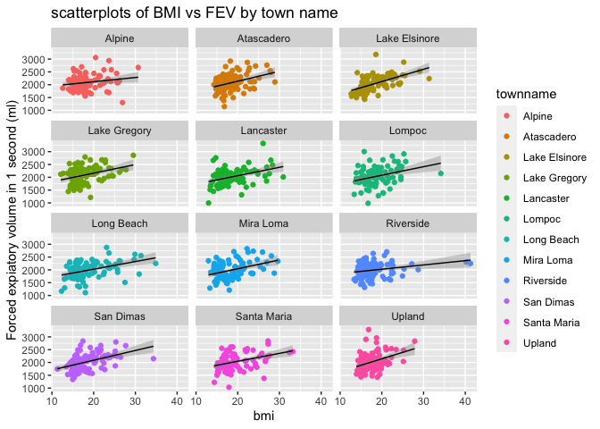
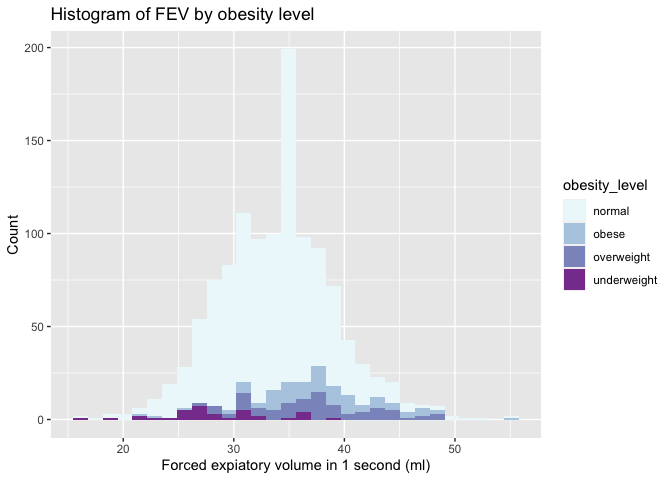

Assignment 2
================
Caroline He
10/6/2021

#### Library packages

``` r
library(data.table)
library(dplyr)
```

    ## 
    ## Attaching package: 'dplyr'

    ## The following objects are masked from 'package:data.table':
    ## 
    ##     between, first, last

    ## The following objects are masked from 'package:stats':
    ## 
    ##     filter, lag

    ## The following objects are masked from 'package:base':
    ## 
    ##     intersect, setdiff, setequal, union

``` r
library(dtplyr)
library(ggplot2)
library(RColorBrewer)
```

# Data Wrangling

#### Download and read in the data

``` r
if (!file.exists("chs_individual.csv")) {
download.file("https://raw.githubusercontent.com/USCbiostats/data-science-data/master/01_chs/chs_individual.csv",
              destfile = "chs_individual.csv", 
              method="libcurl", 
              timeout = 60
              )
}
individual <- data.table::fread("chs_individual.csv")

if (!file.exists("chs_regional.csv")) {
download.file("https://raw.githubusercontent.com/USCbiostats/data-science-data/master/01_chs/chs_regional.csv",
              destfile = "chs_regional.csv", 
              method="libcurl", 
              timeout = 60
              )
}
regional <- data.table::fread("chs_regional.csv")
```

#### Merge the data

``` r
ind_reg <- merge(
  x = individual,
  y = regional,
  by.x = "townname",
  by.y = "townname",
  all.x = TRUE,
  all.y = FALSE
)
```

#### Check for the Duplicate

After merging the data, make sure you don’t have any duplicates by
counting the number of rows. Make sure it matches. In the case of
missing values, impute data using the average within the variables
“male” and “hispanic.”

``` r
dim(ind_reg)
```

    ## [1] 1200   49

``` r
summary(is.na(ind_reg))
```

    ##   townname          sid             male            race        
    ##  Mode :logical   Mode :logical   Mode :logical   Mode :logical  
    ##  FALSE:1200      FALSE:1200      FALSE:1200      FALSE:1200     
    ##                                                                 
    ##   hispanic         agepft          height          weight       
    ##  Mode :logical   Mode :logical   Mode :logical   Mode :logical  
    ##  FALSE:1200      FALSE:1111      FALSE:1111      FALSE:1111     
    ##                  TRUE :89        TRUE :89        TRUE :89       
    ##     bmi            asthma        active_asthma   father_asthma  
    ##  Mode :logical   Mode :logical   Mode :logical   Mode :logical  
    ##  FALSE:1111      FALSE:1169      FALSE:1200      FALSE:1094     
    ##  TRUE :89        TRUE :31                        TRUE :106      
    ##  mother_asthma     wheeze         hayfever        allergy       
    ##  Mode :logical   Mode :logical   Mode :logical   Mode :logical  
    ##  FALSE:1144      FALSE:1129      FALSE:1082      FALSE:1137     
    ##  TRUE :56        TRUE :71        TRUE :118       TRUE :63       
    ##  educ_parent       smoke            pets          gasstove      
    ##  Mode :logical   Mode :logical   Mode :logical   Mode :logical  
    ##  FALSE:1136      FALSE:1160      FALSE:1200      FALSE:1167     
    ##  TRUE :64        TRUE :40                        TRUE :33       
    ##     fev             fvc             mmef         pm25_mass      
    ##  Mode :logical   Mode :logical   Mode :logical   Mode :logical  
    ##  FALSE:1105      FALSE:1103      FALSE:1094      FALSE:1200     
    ##  TRUE :95        TRUE :97        TRUE :106                      
    ##   pm25_so4        pm25_no3        pm25_nh4        pm25_oc       
    ##  Mode :logical   Mode :logical   Mode :logical   Mode :logical  
    ##  FALSE:1200      FALSE:1200      FALSE:1200      FALSE:1200     
    ##                                                                 
    ##   pm25_ec         pm25_om         pm10_oc         pm10_ec       
    ##  Mode :logical   Mode :logical   Mode :logical   Mode :logical  
    ##  FALSE:1200      FALSE:1200      FALSE:1200      FALSE:1200     
    ##                                                                 
    ##   pm10_tc          formic          acetic           hcl         
    ##  Mode :logical   Mode :logical   Mode :logical   Mode :logical  
    ##  FALSE:1200      FALSE:1200      FALSE:1200      FALSE:1200     
    ##                                                                 
    ##     hno3           o3_max          o3106           o3_24        
    ##  Mode :logical   Mode :logical   Mode :logical   Mode :logical  
    ##  FALSE:1200      FALSE:1200      FALSE:1200      FALSE:1200     
    ##                                                                 
    ##     no2             pm10          no_24hr         pm2_5_fr      
    ##  Mode :logical   Mode :logical   Mode :logical   Mode :logical  
    ##  FALSE:1200      FALSE:1200      FALSE:1100      FALSE:900      
    ##                                  TRUE :100       TRUE :300      
    ##    iacid           oacid         total_acids        lon         
    ##  Mode :logical   Mode :logical   Mode :logical   Mode :logical  
    ##  FALSE:1200      FALSE:1200      FALSE:1200      FALSE:1200     
    ##                                                                 
    ##     lat         
    ##  Mode :logical  
    ##  FALSE:1200     
    ## 

``` r
# Group the data by male and Hispanic characteristics
male_hispanic <- ind_reg[male == 1 & hispanic == 1]
```

``` r
#replacing NAs by means
ind_reg[is.na(agepft), agepft := mean(male_hispanic$agepft, na.rm = TRUE)]
ind_reg[is.na(height), height := mean(male_hispanic$height, na.rm = TRUE)]
```

    ## Warning in `[.data.table`(ind_reg, is.na(height), `:=`(height,
    ## mean(male_hispanic$height, : 138.598394 (type 'double') at RHS position 1
    ## truncated (precision lost) when assigning to type 'integer' (column 7 named
    ## 'height')

``` r
ind_reg[is.na(weight), weight := mean(male_hispanic$weight, na.rm = TRUE)]
```

    ## Warning in `[.data.table`(ind_reg, is.na(weight), `:=`(weight,
    ## mean(male_hispanic$weight, : 82.767068 (type 'double') at RHS position 1
    ## truncated (precision lost) when assigning to type 'integer' (column 8 named
    ## 'weight')

``` r
ind_reg[is.na(bmi), bmi := mean(male_hispanic$bmi, na.rm = TRUE)]
ind_reg[is.na(asthma), asthma := mean(male_hispanic$asthma, na.rm = TRUE)]
```

    ## Warning in `[.data.table`(ind_reg, is.na(asthma), `:=`(asthma,
    ## mean(male_hispanic$asthma, : 0.160156 (type 'double') at RHS position 1
    ## truncated (precision lost) when assigning to type 'integer' (column 10 named
    ## 'asthma')

``` r
ind_reg[is.na(father_asthma), father_asthma := mean(male_hispanic$father_asthma, na.rm = TRUE)]
```

    ## Warning in `[.data.table`(ind_reg, is.na(father_asthma), `:=`(father_asthma, :
    ## 0.084034 (type 'double') at RHS position 1 truncated (precision lost) when
    ## assigning to type 'integer' (column 12 named 'father_asthma')

``` r
ind_reg[is.na(mother_asthma), mother_asthma := mean(male_hispanic$mother_asthma, na.rm = TRUE)]
```

    ## Warning in `[.data.table`(ind_reg, is.na(mother_asthma), `:=`(mother_asthma, :
    ## 0.106719 (type 'double') at RHS position 1 truncated (precision lost) when
    ## assigning to type 'integer' (column 13 named 'mother_asthma')

``` r
ind_reg[is.na(wheeze), wheeze := mean(male_hispanic$wheeze, na.rm = TRUE)]
```

    ## Warning in `[.data.table`(ind_reg, is.na(wheeze), `:=`(wheeze,
    ## mean(male_hispanic$wheeze, : 0.353414 (type 'double') at RHS position 1
    ## truncated (precision lost) when assigning to type 'integer' (column 14 named
    ## 'wheeze')

``` r
ind_reg[is.na(hayfever), hayfever := mean(male_hispanic$hayfever, na.rm = TRUE)]
```

    ## Warning in `[.data.table`(ind_reg, is.na(hayfever), `:=`(hayfever,
    ## mean(male_hispanic$hayfever, : 0.174468 (type 'double') at RHS position 1
    ## truncated (precision lost) when assigning to type 'integer' (column 15 named
    ## 'hayfever')

``` r
ind_reg[is.na(allergy), allergy := mean(male_hispanic$allergy, na.rm = TRUE)]
```

    ## Warning in `[.data.table`(ind_reg, is.na(allergy), `:=`(allergy,
    ## mean(male_hispanic$allergy, : 0.254032 (type 'double') at RHS position 1
    ## truncated (precision lost) when assigning to type 'integer' (column 16 named
    ## 'allergy')

``` r
ind_reg[is.na(educ_parent), educ_parent := mean(male_hispanic$educ_parent, na.rm = TRUE)]
```

    ## Warning in `[.data.table`(ind_reg, is.na(educ_parent), `:=`(educ_parent, :
    ## 2.423868 (type 'double') at RHS position 1 truncated (precision lost) when
    ## assigning to type 'integer' (column 17 named 'educ_parent')

``` r
ind_reg[is.na(smoke), smoke := mean(male_hispanic$smoke, na.rm = TRUE)]
```

    ## Warning in `[.data.table`(ind_reg, is.na(smoke), `:=`(smoke,
    ## mean(male_hispanic$smoke, : 0.150198 (type 'double') at RHS position 1 truncated
    ## (precision lost) when assigning to type 'integer' (column 18 named 'smoke')

``` r
ind_reg[is.na(gasstove), gasstove := mean(male_hispanic$gasstove, na.rm = TRUE)]
```

    ## Warning in `[.data.table`(ind_reg, is.na(gasstove), `:=`(gasstove,
    ## mean(male_hispanic$gasstove, : 0.815686 (type 'double') at RHS position 1
    ## truncated (precision lost) when assigning to type 'integer' (column 20 named
    ## 'gasstove')

``` r
ind_reg[is.na(fev), fev := mean(male_hispanic$fev, na.rm = TRUE)]
ind_reg[is.na(fvc), fvc := mean(male_hispanic$fvc, na.rm = TRUE)]
ind_reg[is.na(mmef), mmef := mean(male_hispanic$mmef, na.rm = TRUE)]
ind_reg[is.na(no_24hr), no_24hr := mean(male_hispanic$no_24hr, na.rm = TRUE)]
ind_reg[is.na(pm2_5_fr), pm2_5_fr := mean(male_hispanic$pm2_5_fr, na.rm = TRUE)]
summary(is.na(ind_reg))
```

    ##   townname          sid             male            race        
    ##  Mode :logical   Mode :logical   Mode :logical   Mode :logical  
    ##  FALSE:1200      FALSE:1200      FALSE:1200      FALSE:1200     
    ##   hispanic         agepft          height          weight       
    ##  Mode :logical   Mode :logical   Mode :logical   Mode :logical  
    ##  FALSE:1200      FALSE:1200      FALSE:1200      FALSE:1200     
    ##     bmi            asthma        active_asthma   father_asthma  
    ##  Mode :logical   Mode :logical   Mode :logical   Mode :logical  
    ##  FALSE:1200      FALSE:1200      FALSE:1200      FALSE:1200     
    ##  mother_asthma     wheeze         hayfever        allergy       
    ##  Mode :logical   Mode :logical   Mode :logical   Mode :logical  
    ##  FALSE:1200      FALSE:1200      FALSE:1200      FALSE:1200     
    ##  educ_parent       smoke            pets          gasstove      
    ##  Mode :logical   Mode :logical   Mode :logical   Mode :logical  
    ##  FALSE:1200      FALSE:1200      FALSE:1200      FALSE:1200     
    ##     fev             fvc             mmef         pm25_mass      
    ##  Mode :logical   Mode :logical   Mode :logical   Mode :logical  
    ##  FALSE:1200      FALSE:1200      FALSE:1200      FALSE:1200     
    ##   pm25_so4        pm25_no3        pm25_nh4        pm25_oc       
    ##  Mode :logical   Mode :logical   Mode :logical   Mode :logical  
    ##  FALSE:1200      FALSE:1200      FALSE:1200      FALSE:1200     
    ##   pm25_ec         pm25_om         pm10_oc         pm10_ec       
    ##  Mode :logical   Mode :logical   Mode :logical   Mode :logical  
    ##  FALSE:1200      FALSE:1200      FALSE:1200      FALSE:1200     
    ##   pm10_tc          formic          acetic           hcl         
    ##  Mode :logical   Mode :logical   Mode :logical   Mode :logical  
    ##  FALSE:1200      FALSE:1200      FALSE:1200      FALSE:1200     
    ##     hno3           o3_max          o3106           o3_24        
    ##  Mode :logical   Mode :logical   Mode :logical   Mode :logical  
    ##  FALSE:1200      FALSE:1200      FALSE:1200      FALSE:1200     
    ##     no2             pm10          no_24hr         pm2_5_fr      
    ##  Mode :logical   Mode :logical   Mode :logical   Mode :logical  
    ##  FALSE:1200      FALSE:1200      FALSE:1200      FALSE:1200     
    ##    iacid           oacid         total_acids        lon         
    ##  Mode :logical   Mode :logical   Mode :logical   Mode :logical  
    ##  FALSE:1200      FALSE:1200      FALSE:1200      FALSE:1200     
    ##     lat         
    ##  Mode :logical  
    ##  FALSE:1200

``` r
suppressWarnings(warning("ind_reg"))
```

All NAs were replaced by means

#### Create a new categorical variable named “obesity\_level” and a summary table

Create a new categorical variable named “obesity\_level” using the BMI
measurement (underweight BMI&lt;14; normal BMI 14-22; overweight BMI
22-24; obese BMI&gt;24). To make sure the variable is rightly coded,
create a summary table that contains the minimum BMI, maximum BMI, and
the total number of observations per category.

``` r
#create a new variable
ind_reg[, obesity_level := 
          fifelse(bmi < 14, "underweight",
                  fifelse(bmi >= 14 & bmi < 22, "normal",
                          fifelse(bmi >= 22 & bmi < 24, "overweight",
                                  fifelse(bmi >= 24, "obese", "none"))))]
```

``` r
#create a summary table
summary_obesity <- ind_reg[,.(
  max_bmi = max(bmi),
  min_bmi = min(bmi),
  total = length(bmi)
), by = obesity_level]
knitr::kable(summary_obesity)
```

| obesity\_level | max\_bmi | min\_bmi | total |
|:---------------|---------:|---------:|------:|
| normal         | 21.96387 | 14.00380 |   975 |
| overweight     | 23.99650 | 22.02353 |    87 |
| obese          | 41.26613 | 24.00647 |   103 |
| underweight    | 13.98601 | 11.29640 |    35 |

#### Create categorical variable “smoke\_gas\_exposure”

Create another categorical variable named “smoke\_gas\_exposure” that
summarizes “Second Hand Smoke” and “Gas Stove.” The variable should have
four categories in total.

``` r
ind_reg[, smoke_gas_exposure := 
          fifelse(smoke == 0 & gasstove == 0, "no_expo",
                  fifelse(smoke == 1 & gasstove == 0, "smoke_expo",
                          fifelse(smoke == 0 & gasstove == 1, "gas_expo",
                                  fifelse(smoke == 1 & gasstove == 1, "smoke_gas_expo","none"))))]
```

#### Creating a summary table of FEV

Create four summary tables showing the average (or proportion, if
binary) and sd of “Forced expiatory volume in 1 second (ml)” and asthma
indicator by town, sex, obesity level, and “smoke\_gas\_exposure.”

``` r
#by town name
summary_fev <- ind_reg[,.(
  avg_fev = mean(fev),
  sd_fev = sd(fev),
  avg_asthma = mean(asthma),
  sd_asthma = sd(asthma)
), by = townname]
knitr::kable(summary_fev)
```

| townname      | avg\_fev |  sd\_fev | avg\_asthma | sd\_asthma |
|:--------------|---------:|---------:|------------:|-----------:|
| Alpine        | 2090.576 | 290.6566 |        0.11 |  0.3144660 |
| Atascadero    | 2081.418 | 323.5128 |        0.25 |  0.4351941 |
| Lake Elsinore | 2047.030 | 303.7138 |        0.12 |  0.3265986 |
| Lake Gregory  | 2094.811 | 318.6348 |        0.15 |  0.3588703 |
| Lancaster     | 2016.676 | 318.3450 |        0.16 |  0.3684529 |
| Lompoc        | 2045.610 | 351.1411 |        0.11 |  0.3144660 |
| Long Beach    | 1993.442 | 320.6366 |        0.13 |  0.3379977 |
| Mira Loma     | 1994.214 | 326.3779 |        0.15 |  0.3588703 |
| Riverside     | 1998.277 | 278.9353 |        0.11 |  0.3144660 |
| San Dimas     | 2029.655 | 318.9705 |        0.17 |  0.3775252 |
| Santa Maria   | 2033.301 | 312.6835 |        0.13 |  0.3379977 |
| Upland        | 2034.723 | 343.4018 |        0.12 |  0.3265986 |

``` r
#by gender
summary_fev <- ind_reg[,.(
  avg_fev = mean(fev),
  sd_fev = sd(fev),
  avg_asthma = mean(asthma),
  sd_asthma = sd(asthma)
), by = male]
knitr::kable(summary_fev)
```

| male | avg\_fev |  sd\_fev | avg\_asthma | sd\_asthma |
|-----:|---------:|---------:|------------:|-----------:|
|    0 | 1973.900 | 315.3421 |   0.1180328 |  0.3229117 |
|    1 | 2104.906 | 307.5156 |   0.1677966 |  0.3740027 |

``` r
#by obesity level
summary_fev <- ind_reg[,.(
  avg_fev = mean(fev),
  sd_fev = sd(fev),
  avg_asthma = mean(asthma),
  sd_asthma = sd(asthma)
), by = obesity_level]
knitr::kable(summary_fev)
```

| obesity\_level | avg\_fev |  sd\_fev | avg\_asthma | sd\_asthma |
|:---------------|---------:|---------:|------------:|-----------:|
| normal         | 2009.639 | 296.4532 |   0.1364103 |  0.3433998 |
| overweight     | 2224.322 | 317.4261 |   0.1609195 |  0.3695869 |
| obese          | 2267.848 | 324.2386 |   0.2038835 |  0.4048535 |
| underweight    | 1699.185 | 304.5785 |   0.0857143 |  0.2840286 |

``` r
#by smoke gas exposure
summary_fev <- ind_reg[,.(
  avg_fev = mean(fev),
  sd_fev = sd(fev),
  avg_asthma = mean(asthma),
  sd_asthma = sd(asthma)
), by = smoke_gas_exposure]
knitr::kable(summary_fev)
```

| smoke\_gas\_exposure | avg\_fev |  sd\_fev | avg\_asthma | sd\_asthma |
|:---------------------|---------:|---------:|------------:|-----------:|
| no\_expo             | 2047.460 | 332.8773 |   0.1365462 |  0.3440592 |
| smoke\_expo          | 2092.556 | 297.2326 |   0.1538462 |  0.3655178 |
| gas\_expo            | 2034.331 | 318.1718 |   0.1471748 |  0.3545131 |
| smoke\_gas\_expo     | 2029.273 | 299.6817 |   0.1258278 |  0.3327589 |

# Data EDA and visualization

The primary questions of interest are:

-   What is the association between BMI and FEV (forced expiratory
    volume)?
-   What is the association between smoke and gas exposure and FEV?
-   What is the association between PM2.5 exposure and FEV?

Follow the EDA checklist. Be sure to focus on the key variables.
Visualization Create the following figures and interpret them. Be sure
to include easily understandable axes, titles, and legends.

#### Date EDA

``` r
dim(ind_reg)
```

    ## [1] 1200   51

``` r
head(ind_reg)
```

    ##    townname sid male race hispanic    agepft height weight      bmi asthma
    ## 1:   Alpine 835    0    W        0 10.099932    143     69 15.33749      0
    ## 2:   Alpine 838    0    O        1  9.486653    133     62 15.93183      0
    ## 3:   Alpine 839    0    M        1 10.053388    142     86 19.38649      0
    ## 4:   Alpine 840    0    W        0  9.965777    146     78 16.63283      0
    ## 5:   Alpine 841    1    W        1 10.548939    150     78 15.75758      0
    ## 6:   Alpine 842    1    M        1  9.489391    139     65 15.29189      0
    ##    active_asthma father_asthma mother_asthma wheeze hayfever allergy
    ## 1:             0             0             0      0        0       1
    ## 2:             0             0             0      0        0       0
    ## 3:             0             0             1      1        1       1
    ## 4:             0             0             0      0        0       0
    ## 5:             0             0             0      0        0       0
    ## 6:             0             0             0      1        0       0
    ##    educ_parent smoke pets gasstove      fev      fvc     mmef pm25_mass
    ## 1:           3     0    1        0 2529.276 2826.316 3406.579      8.74
    ## 2:           4     0    1        0 1737.793 1963.545 2133.110      8.74
    ## 3:           3     1    1        0 2121.711 2326.974 2835.197      8.74
    ## 4:           2     0    0        0 2466.791 2638.221 3466.464      8.74
    ## 5:           5     0    1        0 2251.505 2594.649 2445.151      8.74
    ## 6:           1     1    1        0 2188.716 2423.934 2524.599      8.74
    ##    pm25_so4 pm25_no3 pm25_nh4 pm25_oc pm25_ec pm25_om pm10_oc pm10_ec pm10_tc
    ## 1:     1.73     1.59     0.88    2.54    0.48    3.04    3.25    0.49    3.75
    ## 2:     1.73     1.59     0.88    2.54    0.48    3.04    3.25    0.49    3.75
    ## 3:     1.73     1.59     0.88    2.54    0.48    3.04    3.25    0.49    3.75
    ## 4:     1.73     1.59     0.88    2.54    0.48    3.04    3.25    0.49    3.75
    ## 5:     1.73     1.59     0.88    2.54    0.48    3.04    3.25    0.49    3.75
    ## 6:     1.73     1.59     0.88    2.54    0.48    3.04    3.25    0.49    3.75
    ##    formic acetic  hcl hno3 o3_max o3106 o3_24   no2  pm10 no_24hr pm2_5_fr
    ## 1:   1.03   2.49 0.41 1.98  65.82 55.05 41.23 12.18 24.73    2.48    10.28
    ## 2:   1.03   2.49 0.41 1.98  65.82 55.05 41.23 12.18 24.73    2.48    10.28
    ## 3:   1.03   2.49 0.41 1.98  65.82 55.05 41.23 12.18 24.73    2.48    10.28
    ## 4:   1.03   2.49 0.41 1.98  65.82 55.05 41.23 12.18 24.73    2.48    10.28
    ## 5:   1.03   2.49 0.41 1.98  65.82 55.05 41.23 12.18 24.73    2.48    10.28
    ## 6:   1.03   2.49 0.41 1.98  65.82 55.05 41.23 12.18 24.73    2.48    10.28
    ##    iacid oacid total_acids       lon      lat obesity_level smoke_gas_exposure
    ## 1:  2.39  3.52         5.5 -116.7664 32.83505        normal            no_expo
    ## 2:  2.39  3.52         5.5 -116.7664 32.83505        normal            no_expo
    ## 3:  2.39  3.52         5.5 -116.7664 32.83505        normal         smoke_expo
    ## 4:  2.39  3.52         5.5 -116.7664 32.83505        normal            no_expo
    ## 5:  2.39  3.52         5.5 -116.7664 32.83505        normal            no_expo
    ## 6:  2.39  3.52         5.5 -116.7664 32.83505        normal         smoke_expo

``` r
tail(ind_reg)
```

    ##    townname  sid male race hispanic    agepft height weight      bmi asthma
    ## 1:   Upland 1866    0    O        1  9.806982    139     60 14.11559      0
    ## 2:   Upland 1867    0    M        1  9.618070    140     71 16.46568      0
    ## 3:   Upland 2031    1    W        0  9.798768    135     83 20.70084      0
    ## 4:   Upland 2032    1    W        0  9.549624    137     59 14.28855      0
    ## 5:   Upland 2033    0    M        0 10.121834    130     67 18.02044      0
    ## 6:   Upland 2053    0    W        0  9.966942    138     82 19.41148      0
    ##    active_asthma father_asthma mother_asthma wheeze hayfever allergy
    ## 1:             0             0             0      0        0       0
    ## 2:             0             1             0      0        0       0
    ## 3:             0             0             0      1        0       1
    ## 4:             0             0             1      1        1       1
    ## 5:             1             0             0      1        1       0
    ## 6:             0             0             0      0        0       0
    ##    educ_parent smoke pets gasstove      fev      fvc     mmef pm25_mass
    ## 1:           3     0    1        0 1691.275 1928.859 1890.604     22.46
    ## 2:           3     0    1        0 1733.338 1993.040 2072.643     22.46
    ## 3:           3     0    1        1 2034.177 2505.535 1814.075     22.46
    ## 4:           3     0    1        1 2077.703 2275.338 2706.081     22.46
    ## 5:           3     0    1        1 1929.866 2122.148 2558.054     22.46
    ## 6:           3     0    1        0 2120.266 2443.876 2447.494     22.46
    ##    pm25_so4 pm25_no3 pm25_nh4 pm25_oc pm25_ec pm25_om pm10_oc pm10_ec pm10_tc
    ## 1:     2.65     7.75     2.96    6.49    1.19    7.79    8.32    1.22    9.54
    ## 2:     2.65     7.75     2.96    6.49    1.19    7.79    8.32    1.22    9.54
    ## 3:     2.65     7.75     2.96    6.49    1.19    7.79    8.32    1.22    9.54
    ## 4:     2.65     7.75     2.96    6.49    1.19    7.79    8.32    1.22    9.54
    ## 5:     2.65     7.75     2.96    6.49    1.19    7.79    8.32    1.22    9.54
    ## 6:     2.65     7.75     2.96    6.49    1.19    7.79    8.32    1.22    9.54
    ##    formic acetic  hcl hno3 o3_max o3106 o3_24   no2 pm10 no_24hr pm2_5_fr iacid
    ## 1:   2.67   4.73 0.46 4.03  63.83  46.5  22.2 37.97 40.8   18.48    27.73  4.49
    ## 2:   2.67   4.73 0.46 4.03  63.83  46.5  22.2 37.97 40.8   18.48    27.73  4.49
    ## 3:   2.67   4.73 0.46 4.03  63.83  46.5  22.2 37.97 40.8   18.48    27.73  4.49
    ## 4:   2.67   4.73 0.46 4.03  63.83  46.5  22.2 37.97 40.8   18.48    27.73  4.49
    ## 5:   2.67   4.73 0.46 4.03  63.83  46.5  22.2 37.97 40.8   18.48    27.73  4.49
    ## 6:   2.67   4.73 0.46 4.03  63.83  46.5  22.2 37.97 40.8   18.48    27.73  4.49
    ##    oacid total_acids       lon      lat obesity_level smoke_gas_exposure
    ## 1:   7.4       11.43 -117.6484 34.09751        normal            no_expo
    ## 2:   7.4       11.43 -117.6484 34.09751        normal            no_expo
    ## 3:   7.4       11.43 -117.6484 34.09751        normal           gas_expo
    ## 4:   7.4       11.43 -117.6484 34.09751        normal           gas_expo
    ## 5:   7.4       11.43 -117.6484 34.09751        normal           gas_expo
    ## 6:   7.4       11.43 -117.6484 34.09751        normal            no_expo

``` r
summary(is.na(ind_reg))
```

    ##   townname          sid             male            race        
    ##  Mode :logical   Mode :logical   Mode :logical   Mode :logical  
    ##  FALSE:1200      FALSE:1200      FALSE:1200      FALSE:1200     
    ##   hispanic         agepft          height          weight       
    ##  Mode :logical   Mode :logical   Mode :logical   Mode :logical  
    ##  FALSE:1200      FALSE:1200      FALSE:1200      FALSE:1200     
    ##     bmi            asthma        active_asthma   father_asthma  
    ##  Mode :logical   Mode :logical   Mode :logical   Mode :logical  
    ##  FALSE:1200      FALSE:1200      FALSE:1200      FALSE:1200     
    ##  mother_asthma     wheeze         hayfever        allergy       
    ##  Mode :logical   Mode :logical   Mode :logical   Mode :logical  
    ##  FALSE:1200      FALSE:1200      FALSE:1200      FALSE:1200     
    ##  educ_parent       smoke            pets          gasstove      
    ##  Mode :logical   Mode :logical   Mode :logical   Mode :logical  
    ##  FALSE:1200      FALSE:1200      FALSE:1200      FALSE:1200     
    ##     fev             fvc             mmef         pm25_mass      
    ##  Mode :logical   Mode :logical   Mode :logical   Mode :logical  
    ##  FALSE:1200      FALSE:1200      FALSE:1200      FALSE:1200     
    ##   pm25_so4        pm25_no3        pm25_nh4        pm25_oc       
    ##  Mode :logical   Mode :logical   Mode :logical   Mode :logical  
    ##  FALSE:1200      FALSE:1200      FALSE:1200      FALSE:1200     
    ##   pm25_ec         pm25_om         pm10_oc         pm10_ec       
    ##  Mode :logical   Mode :logical   Mode :logical   Mode :logical  
    ##  FALSE:1200      FALSE:1200      FALSE:1200      FALSE:1200     
    ##   pm10_tc          formic          acetic           hcl         
    ##  Mode :logical   Mode :logical   Mode :logical   Mode :logical  
    ##  FALSE:1200      FALSE:1200      FALSE:1200      FALSE:1200     
    ##     hno3           o3_max          o3106           o3_24        
    ##  Mode :logical   Mode :logical   Mode :logical   Mode :logical  
    ##  FALSE:1200      FALSE:1200      FALSE:1200      FALSE:1200     
    ##     no2             pm10          no_24hr         pm2_5_fr      
    ##  Mode :logical   Mode :logical   Mode :logical   Mode :logical  
    ##  FALSE:1200      FALSE:1200      FALSE:1200      FALSE:1200     
    ##    iacid           oacid         total_acids        lon         
    ##  Mode :logical   Mode :logical   Mode :logical   Mode :logical  
    ##  FALSE:1200      FALSE:1200      FALSE:1200      FALSE:1200     
    ##     lat          obesity_level   smoke_gas_exposure
    ##  Mode :logical   Mode :logical   Mode :logical     
    ##  FALSE:1200      FALSE:1200      FALSE:1200

The dataset seems to be good.

#### Facet plot showing scatterplots with regression lines of BMI vs FEV by “townname”.

``` r
#scatter plot
ind_reg %>%
    ggplot(mapping = aes(x = bmi, y = fev)) + 
    geom_point(mapping = aes(color = townname)) + 
    geom_smooth(method = "lm", color = "black", size = 0.5) +
    facet_wrap(~ townname, nrow = 5)
```

    ## `geom_smooth()` using formula 'y ~ x'

<!-- -->

``` r
    labs(
      x = "bmi",
      y = "Forced expiatory volume in 1 second (ml)",
      title = "scatterplots of BMI vs FEV by town name")
```

    ## $x
    ## [1] "bmi"
    ## 
    ## $y
    ## [1] "Forced expiatory volume in 1 second (ml)"
    ## 
    ## $title
    ## [1] "scatterplots of BMI vs FEV by town name"
    ## 
    ## attr(,"class")
    ## [1] "labels"

Based the graph, there was a positive association between BMI and forced
expiatory volume in 1 second(ml) for all towns.

#### Stacked histograms of FEV by BMI category and FEV by smoke/gas exposure. Use different color schemes than the ggplot default.

``` r
#histograms of FEV by BMI
ind_reg %>%
    ggplot(mapping = aes(x = fev)) + 
    geom_histogram(mapping = aes (fill = obesity_level)) +
    scale_fill_brewer(palette = "BuPu") +
    labs(
      x = "Forced expiatory volume in 1 second (ml)",
      y = "Count",
      title = "Histogram of FEV by obesity level")
```

    ## `stat_bin()` using `bins = 30`. Pick better value with `binwidth`.

<!-- -->

The normal and obese obesity level almost followed a normal
distribution. And for overweight and underweight obesity level, the
distribution required more information to be explained.

``` r
#histograms of FEV by smoke/gas exposure
ind_reg %>%
    ggplot(mapping = aes(x = fev)) + 
    geom_histogram(mapping = aes (fill = smoke_gas_exposure)) +
    scale_fill_brewer(palette = "BuPu") +
    labs(
      x = "Forced expiatory volume in 1 second (ml)",
      y = "Count",
      title = "Histogram of FEV by smoke_gas_expose")
```

    ## `stat_bin()` using `bins = 30`. Pick better value with `binwidth`.

<!-- -->

The gas\_expose seemed to have normal distribution, whereas the
no\_expose, smoke\_expose and smoke\_gas\_expo seemed to have a bi-modal
distribution.

#### Bar chart of BMI by smoke/gas exposure.

``` r
ind_reg %>%
    ggplot(mapping = aes(x = obesity_level)) + 
    geom_bar(mapping = aes (fill = smoke_gas_exposure)) +
    scale_fill_brewer(palette = "BuPu") +
    labs(
      x = "obesity level",
      y = "Count",
      title = "Barplot of BMI by smoke_gas_expose")
```

<!-- -->

Among all obesity levels, exposure of gas were the greatest part based
on the bar plot. And the next greatest part was no exposure.
Smoke\_gas\_exposure was the third greatest part and smoke\_exposure was
the smallest.

#### Statistical summary graphs of FEV by BMI and FEV by smoke/gas exposure category.
