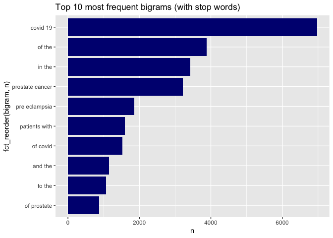
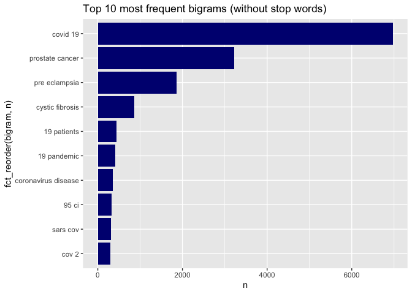

Assignment 3
================
Caroline He
11/3/2021

### R packages

``` r
library(tidyverse)
```

    ## ── Attaching packages ─────────────────────────────────────── tidyverse 1.3.1 ──

    ## ✓ ggplot2 3.3.5     ✓ purrr   0.3.4
    ## ✓ tibble  3.1.4     ✓ dplyr   1.0.7
    ## ✓ tidyr   1.1.3     ✓ stringr 1.4.0
    ## ✓ readr   2.0.1     ✓ forcats 0.5.1

    ## ── Conflicts ────────────────────────────────────────── tidyverse_conflicts() ──
    ## x dplyr::filter() masks stats::filter()
    ## x dplyr::lag()    masks stats::lag()

``` r
library(tidytext)
library(stringr)
library(httr)
library(dplyr)
library(ggplot2)
```

# APIs

Using the NCBI API, look for papers that show up under the term
“sars-cov-2 trial vaccine.” Look for the data in the pubmed database,
and then retrieve the details of the paper as shown in lab 7. How many
papers were you able to find?

``` r
website <- xml2::read_html("https://pubmed.ncbi.nlm.nih.gov/?term=sars-cov-2+trial+vaccine.")

# Finding the counts
counts <- xml2::xml_find_first(website, "/html/body/main/div[9]/div[2]/section/div[2]/div/span[1]")

# Turning it into text
counts <- as.character(counts)

# Extracting the data using regex
stringr::str_extract(counts, "[[:digit:],]+")
```

    ## [1] "2,335"

Using the list of pubmed ids you retrieved, download each papers’
details using the query parameter rettype = abstract. If you get more
than 250 ids, just keep the first 250.

``` r
query_ids <- GET(
  url   = "https://eutils.ncbi.nlm.nih.gov/entrez/eutils/esearch.fcgi",
  query = list(
    db     = "pubmed",
    term   = "sars-cov-2 trial vaccine.",
    retmax = 250
    )
)

# Extracting the content of the response of GET
ids <- httr::content(query_ids)
ids
```

    ## {xml_document}
    ## <eSearchResult>
    ## [1] <Count>1044</Count>
    ## [2] <RetMax>250</RetMax>
    ## [3] <RetStart>0</RetStart>
    ## [4] <IdList>\n  <Id>34729549</Id>\n  <Id>34726743</Id>\n  <Id>34715931</Id>\n ...
    ## [5] <TranslationSet>\n  <Translation>\n    <From>sars-cov-2</From>\n    <To>" ...
    ## [6] <TranslationStack>\n  <TermSet>\n    <Term>"sars-cov-2"[MeSH Terms]</Term ...
    ## [7] <QueryTranslation>("sars-cov-2"[MeSH Terms] OR "sars-cov-2"[All Fields] O ...

``` r
# Turn the result into a character vector
ids <- as.character(ids)

# Find all the ids 
ids <- stringr::str_extract_all(ids, "<Id>[[:digit:]]+</Id>")[[1]]

# Remove all the leading and trailing <Id> </Id>. Make use of "|"
ids <- stringr::str_remove_all(ids, "<Id>|</Id>")
```

``` r
publications <- GET(
  url = "https://eutils.ncbi.nlm.nih.gov/",
  path = "entrez/eutils/efetch.fcgi",
  query = list(
    db = "pubmed",
    id = paste(ids, collapse = ","),
    retmax = 250,
    rettype = "abstract"
    )
)

# Turning the output into character vector
publications <- httr::content(publications)
publications_txt <- as.character(publications)
```

As we did in lab 7. Create a dataset containing the following:

Pubmed ID number, Title of the paper, Name of the journal where it was
published, Publication date, and Abstract of the paper (if any).

``` r
pub_char_list <- xml2::xml_children(publications)
pub_char_list <- sapply(pub_char_list, as.character)
```

Extract titles of the paper

``` r
titles <- str_extract(pub_char_list, "<ArticleTitle>[[:print:][:space:]]+</ArticleTitle>")
titles <- str_remove_all(titles, "</?[[:alnum:]- =\"]+>")
```

Extract the journal name of the paper

``` r
journal_name <- str_extract(pub_char_list, "<Journal>[[:print:][:space:]]+</Journal>")
journal_name <- str_extract(journal_name, "<Title>[[:print:][:space:]]+</Title>")
journal_name <- str_remove_all(journal_name, "</?[[:alnum:]- =\"]+>") 
journal_name <- str_replace_all(journal_name, "[[:space:]]+", " ")
```

Extract the publication date of the paper

``` r
PubDate <- str_extract(pub_char_list, "<PubDate>[[:print:][:space:]]+</PubDate>")
PubDate <- str_remove_all(PubDate, "</?[[:alnum:]- =\"]+>")
PubDate <- str_replace_all(PubDate, "[[:space:]]+", " ")
```

Extract abstract of the paper

``` r
abstracts <- str_extract(pub_char_list, "<Abstract>[[:print:][:space:]]+</Abstract>")
abstracts <- str_remove_all(abstracts, "</?[[:alnum:]- =\"]+>")
abstracts <- str_replace_all(abstracts, "[[:space:]]+", " ")
#Check if there were missing abstract
summary(is.na(abstracts))
```

    ##    Mode   FALSE    TRUE 
    ## logical     218      32

Create a new database combining all the information

``` r
database <- data.frame(
  PubMedId = ids,
  Title    = titles,
  JournalName = journal_name,
  PubDate = PubDate,
  Abstract = abstracts
)
knitr::kable(database[1:10,], caption = "first 10 papers about sars-cov-2 trial vaccine on PubMed")
```

| PubMedId | Title                                                                                                                                              | JournalName                                                                                          | PubDate     | Abstract                                                                                                                                                                                                                                                                                                                                                                                                                                                                                                                                                                                                                                                                                                                                                                                                                                                                                                                                                                                                                                                                                                                                                                                                                                                                                                                                                                                                                                                                                                                                                                                                                                                                                                                                                                                                                                                                                                                                                                                                                                                                                                                                                                                                                                                                                                                                                                                                                                                                                                          |
|:---------|:---------------------------------------------------------------------------------------------------------------------------------------------------|:-----------------------------------------------------------------------------------------------------|:------------|:------------------------------------------------------------------------------------------------------------------------------------------------------------------------------------------------------------------------------------------------------------------------------------------------------------------------------------------------------------------------------------------------------------------------------------------------------------------------------------------------------------------------------------------------------------------------------------------------------------------------------------------------------------------------------------------------------------------------------------------------------------------------------------------------------------------------------------------------------------------------------------------------------------------------------------------------------------------------------------------------------------------------------------------------------------------------------------------------------------------------------------------------------------------------------------------------------------------------------------------------------------------------------------------------------------------------------------------------------------------------------------------------------------------------------------------------------------------------------------------------------------------------------------------------------------------------------------------------------------------------------------------------------------------------------------------------------------------------------------------------------------------------------------------------------------------------------------------------------------------------------------------------------------------------------------------------------------------------------------------------------------------------------------------------------------------------------------------------------------------------------------------------------------------------------------------------------------------------------------------------------------------------------------------------------------------------------------------------------------------------------------------------------------------------------------------------------------------------------------------------------------------|
| 34729549 | Adverse events of active and placebo groups in SARS-CoV-2 vaccine randomized trials: A systematic review.                                          | The Lancet regional health. Europe                                                                   | 2021 Oct 28 | For safety assessment in clinical trials, adverse events (AEs) are reported for the drug under evaluation and compared with AEs in the placebo group. Little is known about the nature of the AEs associated with clinical trials of SARS-CoV-2 vaccines and the extent to which these can be traced to nocebo effects, where negative treatment-related expectations favor their occurrence. In our systematic review, we compared the rates of solicited AEs in the active and placebo groups of SARS-CoV-2 vaccines approved by the Western pharmaceutical regulatory agencies.We implemented a search strategy to identify trial-III studies of SARS-CoV-2 vaccines through the PubMed database. We adopted the PRISMA Statement to perform the study selection and the data collection and identified three trial: two mRNA-based (37590 participants) and one adenovirus type (6736 participants). Relative risks showed that the occurrence of AEs reported in the vaccine groups was higher compared with the placebo groups. The most frequently AEs in both groups were fatigue, headache, local pain, as injection site reactions, and myalgia. In particular, for first doses in placebo recipients, fatigue was reported in 29% and 27% in BNT162b2 and mRNA-1273 groups, respectively, and in 21% of Ad26.COV2.S participants. Headache was reported in 27% in both mRNA groups and in 24% of Ad26.COV2.S recipients. Myalgia was reported in 10% and 14% in mRNA groups (BNT162b2 and mRNA-1273, respectively) and in 13% of Ad26.COV2.S participants. Local pain was reported in 12% and 17% in mRNA groups (BNT162b2 and mRNA-1273, respectively), and in 17% of Ad26.COV2.S recipients. These AEs are more common in the younger population and in the first dose of placebo recipients of the mRNA vaccines. Our results are in agreement with the expectancy theory of nocebo effects and suggest that the AEs associated with COVID-19 vaccines may be related to the nocebo effect. Fondazione CRT - Cassa di Risparmio di Torino, IT (grant number 66346, “GAIA-MENTE” 2019). © 2021 The Authors.                                                                                                                                                                                                                                                                                                                                                                                          |
| 34726743 | Analysis of the Effectiveness of the Ad26.COV2.S Adenoviral Vector Vaccine for Preventing COVID-19.                                                | JAMA network open                                                                                    | 2021 11 01  | Continuous assessment of the effectiveness and safety of the US Food and Drug Administration-authorized SARS-CoV-2 vaccines is critical to amplify transparency, build public trust, and ultimately improve overall health outcomes. To evaluate the effectiveness of the Johnson & Johnson Ad26.COV2.S vaccine for preventing SARS-CoV-2 infection. <AbstractText Label="Design, Setting, and Participants">This comparative effectiveness research study used large-scale longitudinal curation of electronic health records from the multistate Mayo Clinic Health System (Minnesota, Arizona, Florida, Wisconsin, and Iowa) to identify vaccinated and unvaccinated adults between February 27 and July 22, 2021. The unvaccinated cohort was matched on a propensity score derived from age, sex, zip code, race, ethnicity, and previous number of SARS-CoV-2 polymerase chain reaction tests. The final study cohort consisted of 8889 patients in the vaccinated group and 88 898 unvaccinated matched patients. Single dose of the Ad26.COV2.S vaccine. The incidence rate ratio of SARS-CoV-2 infection in the vaccinated vs unvaccinated control cohorts, measured by SARS-CoV-2 polymerase chain reaction testing. The study was composed of 8889 vaccinated patients (4491 men \[50.5%\]; mean \[SD\] age, 52.4 \[16.9\] years) and 88 898 unvaccinated patients (44 748 men \[50.3%\]; mean \[SD\] age, 51.7 \[16.7\] years). The incidence rate ratio of SARS-CoV-2 infection in the vaccinated vs unvaccinated control cohorts was 0.26 (95% CI, 0.20-0.34) (60 of 8889 vaccinated patients vs 2236 of 88 898 unvaccinated individuals), which corresponds to an effectiveness of 73.6% (95% CI, 65.9%-79.9%) and a 3.73-fold reduction in SARS-CoV-2 infections. This study’s findings are consistent with the clinical trial-reported efficacy of Ad26.COV2.S and the first retrospective analysis, suggesting that the vaccine is effective at reducing SARS-CoV-2 infection, even with the spread of variants such as Alpha or Delta that were not present in the original studies, and reaffirm the urgent need to continue mass vaccination efforts globally.                                                                                                                                                                                                                                                                                                                               |
| 34715931 | Lessons from Israel’s COVID-19 Green Pass program.                                                                                                 | Israel journal of health policy research                                                             | 2021 10 29  | As of the beginning of March 2021, Israeli law requires the presentation of a Green Pass as a precondition for entering certain businesses and public spheres. Entitlement for a Green Pass is granted to Israelis who have been vaccinated with two doses of COVID-19 vaccine, who have recovered from COVID-19, or who are participating in a clinical trial for vaccine development in Israel. The Green Pass is essential for retaining immune individuals’ freedom of movement and for promoting the public interest in reopening the economic, educational, and cultural spheres of activity. Nonetheless, and as the Green Pass imposes restrictions on the movement of individuals who had not been vaccinated or who had not recovered, it is not consonant with solidarity and trust building. Implementing the Green Pass provision while advancing its effectiveness on the one hand, and safeguarding equality, proportionality, and fairness on the other hand may imbue this measure with ethical legitimacy despite involving a potential breach of trust and solidarity. © 2021. The Author(s).                                                                                                                                                                                                                                                                                                                                                                                                                                                                                                                                                                                                                                                                                                                                                                                                                                                                                                                                                                                                                                                                                                                                                                                                                                                                                                                                                                                                  |
| 34713912 | Vaccine development and technology for SARS-CoV-2: current insights.                                                                               | Journal of medical virology                                                                          | 2021 Oct 29 | SARS-CoV-2 is associated to a severe respiratory disease in China, that rapidly spread across continents. Since the beginning of the pandemic, available data suggested the asymptomatic transmission and patients were treated with specific drugs with efficacy and safety data not always satisfactory. The aim of this review is to describe the vaccines developed by three companies, Pfizer-BioNTech, Moderna and University of Oxford/AstraZeneca, in terms of both technological and pharmaceutical formulation, safety, efficacy and immunogenicity. A critical analysis of phase 1, 2 and 3 clinical trial results available was conducted, comparing the three vaccine candidates, underlining their similarities and differences. All candidates showed consistent efficacy and tolerability; although some differences can be noted, such as their technological formulation, temperature storage, which will be related to logistics and costs. Further studies will be necessary to evaluate long-term effects and to assess the vaccine safety and efficacy in the general population. This article is protected by copyright. All rights reserved. This article is protected by copyright. All rights reserved.                                                                                                                                                                                                                                                                                                                                                                                                                                                                                                                                                                                                                                                                                                                                                                                                                                                                                                                                                                                                                                                                                                                                                                                                                                                                                 |
| 34711598 | BCG vaccination to reduce the impact of COVID-19 in healthcare workers: Protocol for a randomised controlled trial (BRACE trial).                  | BMJ open                                                                                             | 2021 10 28  | BCG vaccination modulates immune responses to unrelated pathogens. This off-target effect could reduce the impact of emerging pathogens. As a readily available, inexpensive intervention that has a well-established safety profile, BCG is a good candidate for protecting healthcare workers (HCWs) and other vulnerable groups against COVID-19. This international multicentre phase III randomised controlled trial aims to determine if BCG vaccination reduces the incidence of symptomatic and severe COVID-19 at 6 months (co-primary outcomes) compared with no BCG vaccination. We plan to randomise 10 078 HCWs from Australia, The Netherlands, Spain, the UK and Brazil in a 1:1 ratio to BCG vaccination or no BCG (control group). The participants will be followed for 1 year with questionnaires and collection of blood samples. For any episode of illness, clinical details will be collected daily, and the participant will be tested for SARS-CoV-2 infection. The secondary objectives are to determine if BCG vaccination reduces the rate, incidence, and severity of any febrile or respiratory illness (including SARS-CoV-2), as well as work absenteeism. The safety of BCG vaccination in HCWs will also be evaluated. Immunological analyses will assess changes in the immune system following vaccination, and identify factors associated with susceptibility to or protection against SARS-CoV-2 and other infections. Ethical and governance approval will be obtained from participating sites. Results will be published in peer-reviewed open-access journals. The final cleaned and locked database will be deposited in a data sharing repository archiving system. ClinicalTrials.gov NCT04327206. © Author(s) (or their employer(s)) 2021. Re-use permitted under CC BY. Published by BMJ.                                                                                                                                                                                                                                                                                                                                                                                                                                                                                                                                                                                                                                                                         |
| 34704204 | COVID-19 Testing and Vaccine Acceptability Among Homeless-Experienced Adults: Qualitative Data from Two Samples.                                   | Journal of general internal medicine                                                                 | 2021 Oct 26 | Homeless-experienced populations are at increased risk of exposure to SARS-CoV-2 due to their living environments and face an increased risk of severe COVID-19 disease due to underlying health conditions. Little is known about COVID-19 testing and vaccination acceptability among homeless-experienced populations. To understand the facilitators and barriers to COVID-19 testing and vaccine acceptability among homeless-experienced adults. We conducted in-depth interviews with participants from July to October 2020. We purposively recruited participants from (1) a longitudinal cohort of homeless-experienced older adults in Oakland, CA (n=37) and (2) a convenience sample of people (n=57) during a mobile outreach COVID-19 testing event in San Francisco. Adults with current or past experience of homelessness. We asked participants about their experiences with and attitudes towards COVID-19 testing and their perceptions of COVID-19 vaccinations. We used participant observation techniques to document the interactions between testing teams and those approached for testing. We audio-recorded, transcribed, and content analyzed all interviews and identified major themes and subthemes. Participants found incentivized COVID-19 testing administered in unsheltered settings and supported by community health outreach workers (CHOWs) to be acceptable. The majority of participants expressed a positive inclination toward vaccine acceptability, citing a desire to return to routine life and civic responsibility. Those who expressed hesitancy cited a desire to see trial data, concerns that vaccines included infectious materials, and mistrust of the government. Participants expressed positive evaluations of the incentivized, mobile COVID-19 testing supported by CHOWs in unsheltered settings. The majority of participants expressed a positive inclination toward vaccination. Vaccine hesitancy concerns must be addressed when designing vaccine delivery strategies that overcome access challenges. Based on the successful implementation of COVID-19 testing, we recommend mobile delivery of vaccines using trusted CHOWs to address concerns and facilitate wider access to and uptake of the COVID vaccine. © 2021. Society of General Internal Medicine.                                                                                                                                                                         |
| 34703690 | A Rare Variant of Guillain-Barre Syndrome Following Ad26.COV2.S Vaccination.                                                                       | Cureus                                                                                               | 2021 Sep    | Efforts to combat the global pandemic caused by severe acute respiratory syndrome coronavirus 2 (SARS-CoV-2) range from adequate diagnostic testing and contract tracing to vaccination for the prevention of coronavirus disease 2019 (COVID-19). In the United States alone, three vaccinations have been authorized for emergency use (EUA) or approved to prevent COVID-19. The Ad26.COV2.S vaccine by Johnson and Johnson (New Brunswick, New Jersey) is the only adenovirus-based vaccine and deemed relatively effective and safe by the US Food and Drug Administration (FDA) following its clinical trial. Since its introduction, the US FDA has placed a warning on the vaccine adverse event reporting system (VAERS) after more than 100 cases of Guillain-Barre Syndrome (GBS) were reported. Herein, we outline the hospital course of a generally healthy 49-year-old female who experienced an axonal form of GBS nine days after receiving the Ad26.COV2.S vaccine. Copyright © 2021, Morehouse et al.                                                                                                                                                                                                                                                                                                                                                                                                                                                                                                                                                                                                                                                                                                                                                                                                                                                                                                                                                                                                                                                                                                                                                                                                                                                                                                                                                                                                                                                                                          |
| 34702753 | Humoral immunogenicity of the seasonal influenza vaccine before and after CAR-T-cell therapy: a prospective observational study.                   | Journal for immunotherapy of cancer                                                                  | 2021 10     | Recipients of chimeric antigen receptor-modified T (CAR-T) cell therapies for B cell malignancies have profound and prolonged immunodeficiencies and are at risk for serious infections, including respiratory virus infections. Vaccination may be important for infection prevention, but there are limited data on vaccine immunogenicity in this population. We conducted a prospective observational study of the humoral immunogenicity of commercially available 2019-2020 inactivated influenza vaccines in adults immediately prior to or while in durable remission after CD19-, CD20-, or B cell maturation antigen-targeted CAR-T-cell therapy, as well as controls. We tested for antibodies to all four vaccine strains using neutralization and hemagglutination inhibition (HAI) assays. Antibody responses were defined as at least fourfold titer increases from baseline. Seroprotection was defined as a HAI titer ≥40. Enrolled CAR-T-cell recipients were vaccinated 14-29 days prior to (n=5) or 13-57 months following therapy (n=13), and the majority had hypogammaglobulinemia and cellular immunodeficiencies prevaccination. Eight non-immunocompromised adults served as controls. Antibody responses to ≥1 vaccine strain occurred in 2 (40%) individuals before CAR-T-cell therapy and in 4 (31%) individuals vaccinated after CAR-T-cell therapy. An additional 1 (20%) and 6 (46%) individuals had at least twofold increases, respectively. One individual vaccinated prior to CAR-T-cell therapy maintained a response for &gt;3 months following therapy. Across all tested vaccine strains, seroprotection was less frequent in CAR-T-cell recipients than in controls. There was evidence of immunogenicity even among individuals with low immunoglobulin, CD19+ B cell, and CD4+ T-cell counts. These data support consideration for vaccination before and after CAR-T-cell therapy for influenza and other relevant pathogens such as SARS-CoV-2, irrespective of hypogammaglobulinemia or B cell aplasia. However, relatively impaired humoral vaccine immunogenicity indicates the need for additional infection-prevention strategies. Larger studies are needed to refine our understanding of potential correlates of vaccine immunogenicity, and durability of immune responses, in CAR-T-cell therapy recipients. © Author(s) (or their employer(s)) 2021. Re-use permitted under CC BY-NC. No commercial re-use. See rights and permissions. Published by BMJ. |
| 34698827 | Measuring vaccine efficacy against infection and disease in clinical trials: sources and magnitude of bias in COVID-19 vaccine efficacy estimates. | Clinical infectious diseases : an official publication of the Infectious Diseases Society of America | 2021 Oct 26 | Phase III trials have estimated COVID-19 vaccine efficacy (VE) against symptomatic and asymptomatic infection. We explore the direction and magnitude of potential biases in these estimates and their implications for vaccine protection against infection and against disease in breakthrough infections. We developed a mathematical model that accounts for natural and vaccine-induced immunity, changes in serostatus and imperfect sensitivity and specificity of tests for infection and antibodies. We estimated expected biases in VE against symptomatic, asymptomatic and any SARS͏CoV2 infections and against disease following infection for a range of vaccine characteristics and measurement approaches, and the likely overall biases for published trial results that included asymptomatic infections. VE against asymptomatic infection measured by PCR or serology is expected to be low or negative for vaccines that prevent disease but not infection. VE against any infection is overestimated when asymptomatic infections are less likely to be detected than symptomatic infections and the vaccine protects against symptom development. A competing bias towards underestimation arises for estimates based on tests with imperfect specificity, especially when testing is performed frequently. Our model indicates considerable uncertainty in Oxford-AstraZeneca ChAdOx1 and Janssen Ad26.COV2.S VE against any infection, with slightly higher than published, bias-adjusted values of 59.0% (95% uncertainty interval \[UI\] 38.4 to 77.1) and 70.9% (95% UI 49.8 to 80.7) respectively. Multiple biases are likely to influence COVID-19 VE estimates, potentially explaining the observed difference between ChAdOx1 and Ad26.COV2.S vaccines. These biases should be considered when interpreting both efficacy and effectiveness study results. © The Author(s) 2021. Published by Oxford University Press for the Infectious Diseases Society of America.                                                                                                                                                                                                                                                                                                                                                                                                                                                                                                              |
| 34697214 | Author Response: Guillain-Barré Syndrome in the Placebo and Active Arms of a COVID-19 Vaccine Clinical Trial.                                      | Neurology                                                                                            | 2021 10 26  | NA                                                                                                                                                                                                                                                                                                                                                                                                                                                                                                                                                                                                                                                                                                                                                                                                                                                                                                                                                                                                                                                                                                                                                                                                                                                                                                                                                                                                                                                                                                                                                                                                                                                                                                                                                                                                                                                                                                                                                                                                                                                                                                                                                                                                                                                                                                                                                                                                                                                                                                                |

first 10 papers about sars-cov-2 trial vaccine on PubMed

# Text Mining

A new dataset has been added to the data science data repository
<https://github.com/USCbiostats/data-science-data/tree/master/03_pubmed>.
The dataset contains 3241 abstracts from articles across 5 search terms.

``` r
if (!file.exists("pubmed.csv")) {
download.file("https://raw.githubusercontent.com/USCbiostats/data-science-data/master/03_pubmed/pubmed.csv",
              destfile = "pubmed.csv", 
              method="libcurl", 
              timeout = 60
              )
}
pubmed <- data.table::fread("pubmed.csv")
```

## Step 1 Tokenize the abstracts and count the number of each token

Do you see anything interesting? Does removing stop words change what
tokens appear as the most frequent? What are the 5 most common tokens
for each search term after removing stopwords?

``` r
pubmed %>%
  unnest_tokens(token, abstract) %>%
  count(token, sort = TRUE) %>%
  top_n(10, n)%>%
  knitr::kable()
```

| token |     n |
|:------|------:|
| the   | 28126 |
| of    | 24760 |
| and   | 19993 |
| in    | 14653 |
| to    | 10920 |
| a     |  8245 |
| with  |  8038 |
| covid |  7275 |
| 19    |  7080 |
| is    |  5649 |

For the top 10 most frequent words in abstract, most words seemed to be
stop words, including “the”, “of”, “and”, “in” and “to”. Therefore, I
decided to remove stop words for further investigations.

``` r
pubmed %>%
  unnest_tokens(token, abstract) %>%
  anti_join(stop_words, by = c("token" = "word")) %>%
  count(token, sort = TRUE) %>%
  top_n(10, n)%>%
  knitr::kable()
```

| token        |    n |
|:-------------|-----:|
| covid        | 7275 |
| 19           | 7080 |
| patients     | 4674 |
| cancer       | 3999 |
| prostate     | 3832 |
| disease      | 2574 |
| pre          | 2165 |
| eclampsia    | 2005 |
| preeclampsia | 1863 |
| treatment    | 1841 |

After removing stop words, the top 10 list changed and more keywords
occurred in the table. The first five words are “COVID”, “19”,
“patients”, “cancer” and “prostate”.

Next, the top 5 most frequent words list grouped by different search
term was created

``` r
pubmed %>%
  unnest_tokens(token, abstract) %>%
  anti_join(stop_words, by = c("token" = "word")) %>%
  group_by(term) %>%
  count(token) %>%
  top_n(5, n)%>%
  knitr::kable()
```

| term            | token        |    n |
|:----------------|:-------------|-----:|
| covid           | 19           | 7035 |
| covid           | covid        | 7275 |
| covid           | disease      |  943 |
| covid           | pandemic     |  800 |
| covid           | patients     | 2293 |
| cystic fibrosis | cf           |  625 |
| cystic fibrosis | cystic       |  862 |
| cystic fibrosis | disease      |  400 |
| cystic fibrosis | fibrosis     |  867 |
| cystic fibrosis | patients     |  586 |
| meningitis      | clinical     |  187 |
| meningitis      | csf          |  206 |
| meningitis      | meningeal    |  219 |
| meningitis      | meningitis   |  429 |
| meningitis      | patients     |  446 |
| preeclampsia    | eclampsia    | 2005 |
| preeclampsia    | pre          | 2038 |
| preeclampsia    | preeclampsia | 1863 |
| preeclampsia    | pregnancy    |  969 |
| preeclampsia    | women        | 1196 |
| prostate cancer | cancer       | 3840 |
| prostate cancer | disease      |  652 |
| prostate cancer | patients     |  934 |
| prostate cancer | prostate     | 3832 |
| prostate cancer | treatment    |  926 |

For search term “covid”, the top 5 most frequent words were: covid, 19,
patients, disease and pandemic.

For search term “prostate cancer”, the top 5 most frequent words were:
cancer, prostate, patients, treatment and disease.

For search term “preeclampsia”, the top 5 most frequent words were: pre,
eclampsia, preeclampsia, women and pregnancy.

For search term “cystic fibrosis”, the top 5 most frequent words were:
fibrosis, cystic, cf, patients and disease.

For search term “meningitis”, the top 5 most frequent words were:
patients, meningitis, meningeal, csf and clinical.

## Step 2 Tokenize the abstracts into bigrams. Find the 10 most common bigram and visualize them with ggplot2.

``` r
pubmed %>%
  unnest_ngrams(output = bigram, input = abstract, n = 2) %>%
  count(bigram, sort = TRUE) %>%
  top_n(10)%>%
  ggplot(aes(x = n, y = fct_reorder(bigram, n))) +
    geom_col(fill = "navy blue") +
  labs(title = "Top 10 most frequent bigrams (with stop words)")
```

    ## Selecting by n

<!-- -->

The top 10 list were consisted mainly by stopwords. Therefore, I tried
to remove the stop words and see what would happen.

``` r
pubmed %>%
  unnest_ngrams(output = bigram, input = abstract, n = 2) %>%
  separate(bigram, into = c("w1", "w2"), sep = " ") %>%
  anti_join(stop_words, by = c("w1" = "word")) %>%
  anti_join(stop_words, by = c("w2" = "word")) %>%
  unite(bigram, c("w1", "w2"), sep = " ") %>%
  count(bigram, sort = TRUE) %>%
  top_n(10)%>%
  ggplot(aes(x = n, y = fct_reorder(bigram, n))) +
    geom_col(fill = "navy blue") +
  labs(title = "Top 10 most frequent bigrams (without stop words)")
```

    ## Selecting by n

<!-- -->

After removing stop words, the top 10 bi-grams occurred were: covid 19,
prostate cancer, pre elcampsia, cystic fibrosis, 19 patients, 19
pandemic, coronavirus disease, 95 ci, sars cov and cov 2. More useful
information came out gradually.

# Step 3 Calculate the TF-IDF value for each word-search term combination.

(here you want the search term to be the “document”) What are the 5
tokens from each search term with the highest TF-IDF value? How are the
results different from the answers you got in question 1?

``` r
pubmed %>%
  unnest_tokens(token, abstract) %>%
  anti_join(stop_words, by = c("token" = "word")) %>% 
  count(token, term)%>%
  bind_tf_idf(token, term, n)%>%
  group_by(term)%>%
  arrange(desc(tf_idf), .by_group = TRUE) %>%
  top_n(5, tf_idf)%>%
  knitr::kable(caption="top 5 tokens from each search term with highest TF-IDF value")
```

| token           | term            |    n |        tf |       idf |   tf\_idf |
|:----------------|:----------------|-----:|----------:|----------:|----------:|
| covid           | covid           | 7275 | 0.0646920 | 1.6094379 | 0.1041177 |
| pandemic        | covid           |  800 | 0.0071139 | 1.6094379 | 0.0114494 |
| coronavirus     | covid           |  647 | 0.0057534 | 1.6094379 | 0.0092597 |
| sars            | covid           |  372 | 0.0033080 | 1.6094379 | 0.0053240 |
| cov             | covid           |  334 | 0.0029701 | 1.6094379 | 0.0047801 |
| cf              | cystic fibrosis |  625 | 0.0234126 | 0.9162907 | 0.0214528 |
| fibrosis        | cystic fibrosis |  867 | 0.0324780 | 0.5108256 | 0.0165906 |
| cystic          | cystic fibrosis |  862 | 0.0322907 | 0.5108256 | 0.0164949 |
| cftr            | cystic fibrosis |   86 | 0.0032216 | 1.6094379 | 0.0051849 |
| sweat           | cystic fibrosis |   83 | 0.0031092 | 1.6094379 | 0.0050041 |
| meningitis      | meningitis      |  429 | 0.0163959 | 1.6094379 | 0.0263883 |
| meningeal       | meningitis      |  219 | 0.0083700 | 1.6094379 | 0.0134709 |
| pachymeningitis | meningitis      |  149 | 0.0056946 | 1.6094379 | 0.0091652 |
| csf             | meningitis      |  206 | 0.0078731 | 0.9162907 | 0.0072141 |
| meninges        | meningitis      |  106 | 0.0040512 | 1.6094379 | 0.0065202 |
| eclampsia       | preeclampsia    | 2005 | 0.0255268 | 1.6094379 | 0.0410837 |
| preeclampsia    | preeclampsia    | 1863 | 0.0237189 | 1.6094379 | 0.0381741 |
| pregnancy       | preeclampsia    |  969 | 0.0123369 | 0.5108256 | 0.0063020 |
| maternal        | preeclampsia    |  797 | 0.0101470 | 0.5108256 | 0.0051834 |
| gestational     | preeclampsia    |  191 | 0.0024317 | 1.6094379 | 0.0039137 |
| prostate        | prostate cancer | 3832 | 0.0562950 | 1.6094379 | 0.0906033 |
| androgen        | prostate cancer |  305 | 0.0044807 | 1.6094379 | 0.0072114 |
| psa             | prostate cancer |  282 | 0.0041428 | 1.6094379 | 0.0066676 |
| prostatectomy   | prostate cancer |  215 | 0.0031585 | 1.6094379 | 0.0050834 |
| castration      | prostate cancer |  148 | 0.0021742 | 1.6094379 | 0.0034993 |

top 5 tokens from each search term with highest TF-IDF value

For search term “covid”, the top 5 most frequent words were: covid,
pandemic, coronavirus, sars and cov.

For search term “prostate cancer”, the top 5 most frequent words were:
prostate, androgen, psa. prostatectomy and castration.

For search term “preeclampsia”, the top 5 most frequent words were:
eclampsia, preeclampsia, pregancy, maternal and gestational.

For search term “cystic fibrosis”, the top 5 most frequent words were:
cf, fibrosis, cystic, cftr and sweat.

For search term “meningitis”, the top 5 most frequent words were:
meningitis, meningeal, pachymeningitis, csf and meninges.

Compared to frequency table, TF-IDF table retained most words and
replace some general words like treatment and patients by more
professional words including castration and androgen. TF-IDF provided a
closer estimation on medical paper information than frequency.
